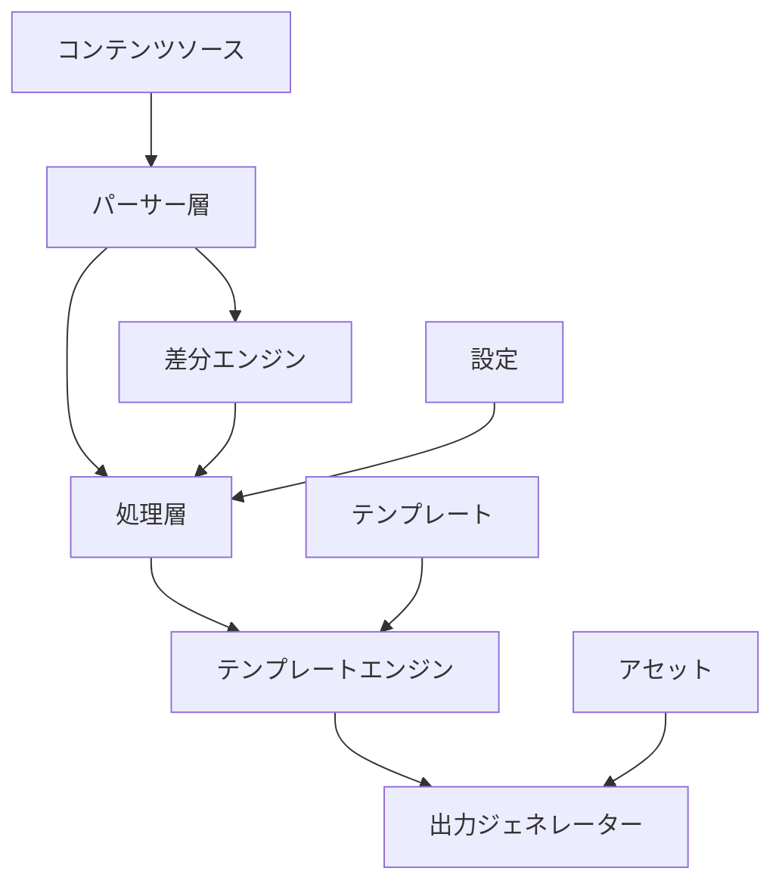
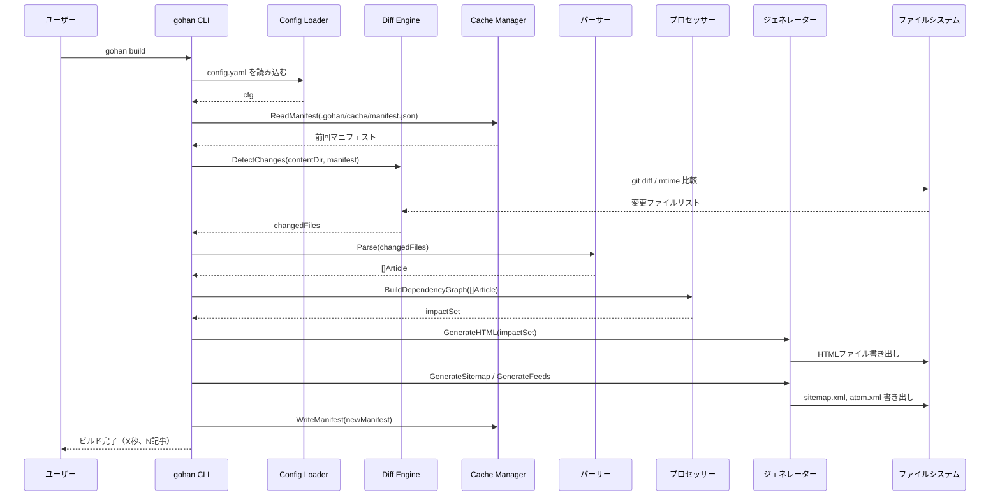
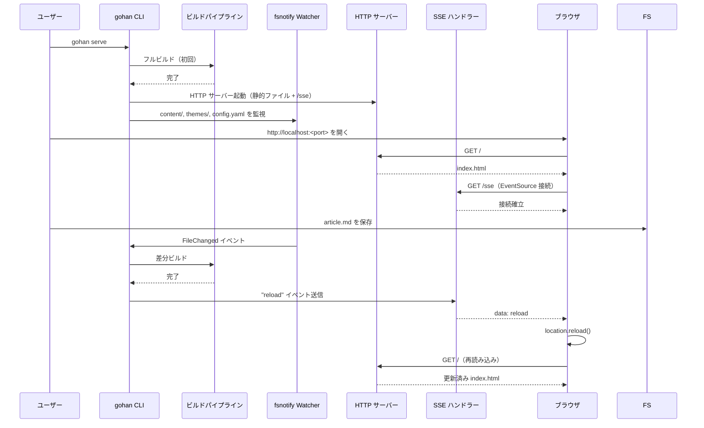
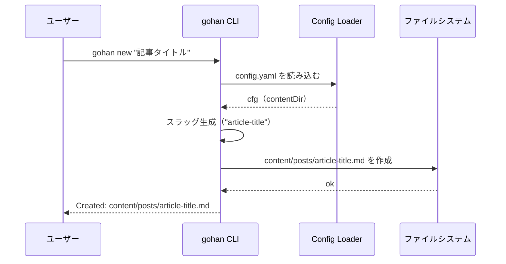

# Design Document: Gohan - GoベースのSSG

## 1. 背景・動機

### なぜ独自のSSGを実装するのか？

HugoやJekyll、Gatsby、Next.jsなど多くの静的サイトジェネレーターが存在する中、以下の理由から独自実装を選択しました。

- **シンプルさの追求**: 既存ツールは機能豊富だが、個人ブログには過剰
- **Goの活用**: Goの並行処理性能とシンプルさを活かす
- **差分ビルドの最適化**: 大量記事を効率的に処理する差分ビルド機能
- **学習コストの削減**: 既存ツールの複雑な設定やプラグインシステムを避け、直感的な操作性を実現

### 既存ツールで満たせない要件

- **Hugo**: 設定が複雑でカスタマイズの学習コストが高い
- **Jekyll**: Ruby依存でビルドが遅い
- **Gatsby / Next.js**: Node.jsエコシステムが重く、シンプルなブログには過剰

### GitHubによる記事管理の設計意図

- MarkdownファイルのバージョンコントロールにGitHubを活用
- ただしGitHub依存を避けるため、ローカルファイルシステムでも動作させる
- 記事の履歴管理や共同レビューワークフローを自然に実現

---

## 2. Goals

### 主要目標

- **個人ブログ向けのシンプルで高速なSSGを提供**
  - 最小限の設定ファイル
  - ビルド時間の短縮（差分ビルドは30秒以内）
  - 静的ファイル生成に特化

### 技術目標

- **差分ビルドによる効率的な動作**
  - 変更された記事のみ再生成
  - 影響範囲の自動計算（タグページ、アーカイブページなど）
  - ビルド時間の最小化

- **Go実装による拡張性と保守性の確保**
  - プラグインアーキテクチャ
  - テスタブルなコード設計
  - 責務の明確な分離

---

## 3. Non-goals

以下はgohanのスコープ外とする。

- **動的コンテンツ生成・サーバーサイドレンダリング**: gohanは純粋な静的ファイル生成に特化する
- **Web管理UI（CMS機能）**: コンテンツ管理はテキストエディタとGitで行う
- **JavaScriptバンドル・CSSミニファイ**: フロントエンドビルドツール（Vite等）の役割であり対象外
- **画像の自動リサイズ・最適化**: CDNや別ツールで担う想定
- **認証・会員機能・コメント機能のバックエンド**: 静的ファイルの範囲外
- **プラグインマーケットプレイスの提供**: プラグインAPIは提供するが、配布基盤は作らない

---

## 4. スコープ

### 対象ユーザー

- **個人ブロガー**: 技術ブログ、日記、ポートフォリオサイト
- **小規模チーム**: 技術ブログ、プロジェクトドキュメント

### 規模の前提

- **記事数**: 500〜10,000件
- **ビルド時間**: フルビルドは5分以内、差分ビルドは30秒以内
- **記事サイズ**: 平均3,000〜5,000文字、最大15,000文字程度

---

## 5. ディレクトリ構造

### 入力側

```
.
├── config.yaml           # サイト設定
├── content/
│   ├── posts/            # ブログ記事（一覧・タグ・アーカイブ対象）
│   │   └── my-post.md
│   └── pages/            # 静的ページ（About, Contact など）
│       └── about.md
├── themes/
│   └── default/
│       └── layouts/      # テンプレートファイル
│           ├── base.html
│           ├── post.html
│           ├── list.html
│           └── partials/
│               ├── header.html
│               └── footer.html
├── assets/               # CSS・画像などの静的ファイル
└── taxonomies/
    ├── tags.yaml         # タグマスター
    └── categories.yaml   # カテゴリマスター
```

### 出力側

```
public/
├── index.html
├── posts/
│   └── my-post/
│       └── index.html
├── pages/
│   └── about/
│       └── index.html
├── tags/
│   └── go/
│       └── index.html
├── categories/
│   └── tech/
│       └── index.html
├── archives/
│   └── 2026/
│       └── 02/
│           └── index.html
├── feed.xml              # RSS 2.0
├── atom.xml              # Atom 1.0
├── sitemap.xml
└── assets/               # 静的ファイルのコピー
```

### 補足

- `themes/<name>/` 構成にすることで、将来的なテーマ切り替えを `config.yaml` の1行変更で対応できる
- `content/posts/` と `content/pages/` を分離することで、記事一覧・タグ・アーカイブ処理の対象を明確に限定できる
- 出力パスは `slug` Front Matterで上書き可能

---

## 6. 機能要件

### 6.1 コア機能

#### Markdown処理
- **Markdownパース**: CommonMark準拠
- **Front Matterサポート**: YAMLフォーマットのメタデータ

#### テンプレート機能
- **テンプレートエンジン**: Go標準の `html/template` を使用
- **テンプレート探索**: ユーザー定義テンプレートの自動探索・読み込み
- **柔軟なテンプレート構造**: 任意のファイル名・ディレクトリ構造で定義可
- **テンプレート変数**: 記事データ・サイト設定・ナビゲーション情報を提供
- **カスタム関数**: 日付フォーマット、タグリンク生成、Markdown変換などのヘルパー関数
- **テンプレート選択**: テンプレートをFront Matterで個別指定

#### コンテンツ管理
- **タグ・カテゴリ管理**: マスターファイルによる一覧管理とバリデーション
- **記事リスト生成**: 日付・タグ・カテゴリ別
- **アーカイブ生成**: 月別アーカイブ
- **静的ページ**: About、Contactなどの静的ページ

#### コードハイライト
- **シンタックスハイライト**: コードブロックの言語別ハイライト
- **行番号表示**: オプション設定

#### ダイアグラムサポート
- **Mermaidダイアグラム**: フローチャート、シーケンス図

#### フィード生成
- **RSS 2.0**: 全記事フィード
- **Atom 1.0**: 規格準拠フィード
- **カテゴリ別フィード**: タグ・カテゴリ別フィード

### 6.2 CLIインターフェース

詳細は Section 11 を参照。主要なコマンドは以下の通り。

```bash
gohan build [--full] [--config=path] [--output=dir]
gohan new <slug>
gohan serve
```

---

## 7. 非機能要件

### 7.1 パフォーマンス要件

#### ビルド性能
- **初回フルビルド**: 1,000記事を5分以内
- **差分ビルド**: 10件の変更を30秒以内
- **並行処理**: CPU数に応じた並行記事処理

### 7.2 スケーラビリティ

- **記事数**: 10,000件まで安定動作

### 7.3 再現性

- **決定論的ビルド**: 同一入力に対して同一出力を保証
- **キャッシュ無効化**: ファイル変更の正確な検出
- **クロスプラットフォーム**: Windows / macOS / Linux で同一出力

### 7.4 保守性・拡張性

#### コード品質
- **テストカバレッジ**: 80%以上
- **静的解析**: `golangci-lint`（`go vet`・`staticcheck`・`gosec` をカバー）
- **依存関係**: 外部依存を最小化
- **ドキュメント**: godoc準拠コメント

#### アーキテクチャ
- **関心の分離**: Parser、Generator、Renderer
- **インターフェース設計**: テスタブルな抽象化
- **設定の外部化**: YAML設定ファイル
- **プラグインAPI**: 機能拡張用インターフェース

### 7.5 運用性

#### ロギング・モニタリング
- **ログ形式**: デフォルトは人間可読形式（`--log-format=json` オプションでJSONに切り替え可）
- **ログレベル**: DEBUG、INFO、WARN、ERROR
- **メトリクス**: ビルド完了時にビルド時間・生成記事数・エラー数を stdout にサマリーとして出力
- **エラートラッキング**: スタックトレース付きエラー

#### 設定管理
- **環境別設定**: development / production
- **設定バリデーション**: 起動時の設定値チェック
- **デフォルト値**: ゼロコンフィグで動作

### 7.6 セキュリティ

- **入力バリデーション**: Markdownおよび設定ファイルの検証
- **パストラバーサル防止**: ファイルパスの正規化
- **依存関係スキャン**: 脆弱性のある依存関係の検出

### 7.7 ポータビリティ

- **クロスプラットフォーム**: Windows / macOS / Linux対応
- **Go単体依存**: 外部ランタイム不要、シングルバイナリ
- **バイナリ配布**: GoReleaserによる自動リリース・配布
- **パッケージマネージャー対応**: Homebrew、Scoop、APTなど
- **CI/CD統合**: GitHub Actionsによる自動テスト・リリース

---

## 8. アーキテクチャ概要

### 8.1 システムアーキテクチャ



### 8.2 データフロー

#### 入力
- **記事ファイル**: `content/posts/*.md`
- **静的ページ**: `content/pages/*.md`
- **設定**: `config.yaml`
- **テンプレート**: `themes/default/layouts/`
- **静的アセット**: `assets/`

#### 処理フロー

1. **コンテンツ解析**
   - Markdownファイルの読み込み
   - Front Matterのパース
   - 依存関係グラフの構築

2. **差分検出**
   - Gitリポジトリの場合: Git diffによる変更ファイルの特定
   - 非 Git環境の場合: ファイルハッシュベースで変更ファイルを特定（差分ビルドは行わずフルビルド）
   - 影響範囲の計算

3. **ページ生成**
   - MarkdownをHTMLへ変換
   - テンプレートの適用
   - 並行処理による最適化

4. **アセット処理**
   - 静的ファイルのコピー
   - ディレクトリ構造の保持

5. **出力配置**
   - ディレクトリ構造の作成
   - ファイルのコピー・生成
   - サイトマップとフィードの生成

#### 出力
- **HTMLファイル**: 各記事・ページ
- **一覧ページ**: インデックス、タグ、カテゴリ
- **フィードファイル**: RSS、Atom
- **サイトマップ**: `sitemap.xml`
- **静的アセット**: CSS、画像

### 8.3 コンポーネント設計

#### パーサー層
```go
type Parser interface {
    ParseMarkdown(content []byte) (*Article, error)
    ParseFrontMatter(data []byte) (*FrontMatter, error)
    ValidateContent(*Article) error
}
```

#### 処理層
```go
type Processor interface {
    BuildDependencyGraph(articles []*Article) *DependencyGraph
    CalculateDiff(oldGraph, newGraph *DependencyGraph) *ChangeSet
    ProcessArticles(articles []*Article) ([]*ProcessedArticle, error)
}
```

#### テンプレートエンジン
```go
type TemplateEngine interface {
    // LoadTemplates はテーマディレクトリ配下の全テンプレートを読み込む
    LoadTemplates(themePath string) error
    RegisterFunctions(funcMap template.FuncMap) error
    Render(templateName string, data interface{}) ([]byte, error)
    GetAvailableTemplates() []string
}
```

#### 差分エンジン
```go
type NodeType int

const (
    NodeTypeArticle  NodeType = iota
    NodeTypeTag
    NodeTypeCategory
    NodeTypeArchive
)

// ChangeSet は差分検出結果。変更・追加・削除ファイルのパス一覧を保持する。
type ChangeSet struct {
    ModifiedFiles []string
    AddedFiles    []string
    DeletedFiles  []string
}

type DiffEngine interface {
    // fromCommit/toCommitに空文字列を指定した場合は直前ビルドとの差分を返す
    DetectChanges(fromCommit, toCommit string) (*ChangeSet, error)
    IsGitRepo() bool
}
```

#### 出力ジェネレーター
```go
// Site はテンプレートに渡すサイト全体情報。Configと記事一覧を保持する。
type Site struct {
    Config   Config
    Articles []*ProcessedArticle
    Tags     []Taxonomy
    Categories []Taxonomy
}

type OutputGenerator interface {
    Write(articles []*ProcessedArticle, site *Site) error
    CopyAssets(srcDir, dstDir string) error
    GenerateSitemap(pages []string) error
    GenerateFeeds(articles []*ProcessedArticle) error
}
```

---

## 9. データモデル設計

### 9.1 記事データ構造

`Article` はファイルから読み込んだローデータ。`ProcessedArticle` はビルド時に生成される派生データを保持する。

```go
// Article: パーサーが生成する入力データ
type Article struct {
    FrontMatter  FrontMatter `yaml:"frontmatter"`
    RawContent   string      `yaml:"raw_content"`
    FilePath     string      `yaml:"file_path"`
    LastModified time.Time   `yaml:"last_modified"`
}

// ProcessedArticle: ビルド時にレンダラーが生成する派生データ
type ProcessedArticle struct {
    Article
    HTMLContent template.HTML
    Summary     string
    OutputPath  string
}

type FrontMatter struct {
    Title       string    `yaml:"title"`
    Date        time.Time `yaml:"date"`
    Draft       bool      `yaml:"draft"`
    Tags        []string  `yaml:"tags"`
    Categories  []string  `yaml:"categories"`
    Description string    `yaml:"description"`
    Author      string    `yaml:"author"`
    Slug        string    `yaml:"slug"`
}
```

### 9.2 タクソノミーシステム

`TaxonomyRegistry` は `tags.yaml` / `categories.yaml` から読み込むマスターデータ。`Type` フィールドはレジストリの構造から明確なため保持しない。

```go
type Taxonomy struct {
    Name        string `yaml:"name"`
    Description string `yaml:"description"`
}

type TaxonomyRegistry struct {
    Tags       []Taxonomy `yaml:"tags"`
    Categories []Taxonomy `yaml:"categories"`
}
```

### 9.3 サイト設定

`config.yaml` のトップレベルの構造と一致するように `Config` 型を定義し、その中に `SiteConfig` などを内包する。

```go
type Config struct {
    Site    SiteConfig             `yaml:"site"`
    Build   BuildConfig            `yaml:"build"`
    Theme   ThemeConfig            `yaml:"theme"`
    Plugins map[string]interface{} `yaml:"plugins"`
}

type SiteConfig struct {
    Title       string `yaml:"title"`
    Description string `yaml:"description"`
    BaseURL     string `yaml:"base_url"`
    Language    string `yaml:"language"`
}

type BuildConfig struct {
    ContentDir   string   `yaml:"content_dir"`
    OutputDir    string   `yaml:"output_dir"`
    AssetsDir    string   `yaml:"assets_dir"`
    ExcludeFiles []string `yaml:"exclude_files"`
    Parallelism  int      `yaml:"parallelism"`
}

type ThemeConfig struct {
    Name   string            `yaml:"name"`
    Dir    string            `yaml:"dir"`
    Params map[string]string `yaml:"params"`
}
```

### 9.4 ビルドマニフェスト

`.gohan/cache/manifest.json` に保存されるビルド履歴で、ハッシュベースの差分検出に使用する。

```go
type BuildManifest struct {
    Version      string              `json:"version"`       // gohanのバージョン
    BuildTime    time.Time           `json:"build_time"`    // 最終ビルド時刻
    LastCommit   string              `json:"last_commit"`   // ビルド時のリポジトリ HEADコミットハッシュ
    FileHashes   map[string]string   `json:"file_hashes"`   // 入力ファイルパス -> SHA-256
    Dependencies map[string][]string `json:"dependencies"`  // ファイルパス -> 依存ファイルパス一覧
    OutputFiles  []OutputFile        `json:"output_files"`  // 生成された出力ファイル一覧
}

type OutputFile struct {
    Path         string    `json:"path"`
    Hash         string    `json:"hash"`
    Size         int64     `json:"size"`
    LastModified time.Time `json:"last_modified"`
    ContentType  string    `json:"content_type"`
}
```

---

## 10. 差分ビルド戦略

### 10.1 差分検出メカニズム

#### 検出方式の選択ロジック

1. カレントディレクトリが Git リポジトリかどうかを `git rev-parse --is-inside-work-tree` で確認
2. Git リポジトリであれば **Git diff ベースの差分検出** を使用
3. Git リポジトリでなければ **ファイルハッシュベースのフルビルド** にフォールバック

> **Note**: 差分ビルド機能は Git リポジトリであることが前提。非 Git 環境ではフルビルドのみ動作する。

#### Gitベースの差分検出（`os/exec` 利用）

外部ライブラリを使用せず、`os/exec` で `git` コマンドを呼び出す。これにより外部依存を最小化しつつ、Git のすべての差分情報を活用できる。

```go
type GitDiffDetector struct {
    repoDir string
}

func (d *GitDiffDetector) DetectChanges(fromCommit, toCommit string) (*ChangeSet, error) {
    out, err := exec.Command(
        "git", "-C", d.repoDir,
        "diff", "--name-status", fromCommit, toCommit,
    ).Output()
    if err != nil {
        return nil, err
    }
    return parseNameStatus(out), nil
}

func IsGitRepo(dir string) bool {
    err := exec.Command("git", "-C", dir, "rev-parse", "--is-inside-work-tree").Run()
    return err == nil
}
```

#### フォールバック：ファイルハッシュベースのフルビルド

Git リポジトリでない場合、ビルドマニフェスト（`.gohan/cache/manifest.json`）に記録したファイルハッシュと現在のファイルハッシュを比較し、変更ファイルを特定する。ただし依存グラフが存在しないため差分ビルドは行わず、フルビルドを実行する。

### 10.2 影響範囲の計算

#### 依存関係グラフ
```go
type DependencyGraph struct {
    nodes map[string]*Node
    edges map[string][]string
}

type Node struct {
    Path         string
    Type         NodeType // NodeTypeArticle, NodeTypeTag, NodeTypeCategory, NodeTypeArchive
    Dependencies []string
    Dependents   []string
    LastModified time.Time
}

func (g *DependencyGraph) CalculateImpact(changedFiles []string) []string {
    impacted := make(map[string]bool)
    for _, file := range changedFiles {
        g.traverseDependents(file, impacted)
    }
    result := make([]string, 0, len(impacted))
    for k := range impacted {
        result = append(result, k)
    }
    return result
}
```

#### 影響範囲の例
- **記事Aを更新** → 記事A・タグページ・カテゴリページ・アーカイブページ・RSS
- **タグマスターを更新** → 全タグページ・関連記事ページ・ナビゲーション
- **テンプレートを更新** → 全ページ（フルビルド）

### 10.3 キャッシュ戦略

#### キャッシュ保存場所

```
.gohan/
└── cache/
    ├── manifest.json     # ファイルハッシュ・依存関係・出力ファイル一覧
    ├── ast/              # パース済みMarkdown AST（gob形式）
    └── html/             # レンダリング済みHTML
```

`.gohan/` はプロジェクトルートに自動生成する。初回 `gohan build` 実行時に `.gohan/` を作成する際、`.gitignore` への追加を推奨する旨をメッセージとして表示する。

#### ビルドキャッシュ
- **パース済みMarkdown**: パース済みASTを gob 形式で `.gohan/cache/ast/` に保存
- **レンダリング済みHTML**: テンプレート適用後のHTMLを `.gohan/cache/html/` に保存

#### キャッシュ無効化
- **ファイル変更**: ファイルの SHA-256 ハッシュが変わった場合に該当キャッシュを無効化
- **依存関係の変更**: 影響範囲のキャッシュを一括無効化
- **設定変更**: `config.yaml` のハッシュが変わった場合はキャッシュ全クリア

---

## 11. CLI仕様

### 11.1 基本コマンド

#### build - サイトビルド
```bash
# 基本ビルド（差分）
gohan build

# フルビルド
gohan build --full

# 設定ファイルを指定
gohan build --config=config.production.yaml

# 出力ディレクトリを指定
gohan build --output=dist

# 並行数を指定
gohan build --parallel=8

# ドライラン
gohan build --dry-run
```

#### new - 記事スケルトンの生成
```bash
# 新しい記事を生成（content/posts/ 配下に作成）
gohan new my-first-post

# タイトルを指定
gohan new --title="My First Post" my-first-post

# 静的ページとして生成
gohan new --type=page about
```

#### serve - 開発用ローカルサーバー
```bash
# デフォルトポート（1313）で起動
gohan serve

# ポートを指定
gohan serve --port=8080

# ホストを指定
gohan serve --host=0.0.0.0 --port=8080
```

### 11.2 設定ファイル

#### グローバル設定
```yaml
# ~/.gohan/config.yaml
defaults:
  theme: default
```

#### プロジェクト設定
```yaml
# config.yaml
site:
  title: "My Blog"
  description: "A personal blog"
  base_url: "https://example.com"
  language: "ja"

build:
  content_dir: "content"
  output_dir: "public"
  assets_dir: "assets"
  parallelism: 4

theme:
  name: "default"
  dir: "themes/default"
```

---

## 12. 開発サーバー

### 12.1 概要

`gohan serve` で起動するローカル開発用HTTPサーバー。ファイル配信には Go 標準の `net/http` を使用する。ファイル変更検知には外部ライブラリ `fsnotify` を使用する（開発サーバー限定の依存）。

### 12.2 基本仕様

```go
// FileWatcher はファイル変更検知インターフェース。実装には fsnotify を使用する。
type FileWatcher interface {
    Add(path string) error
    Events() <-chan string
    Close() error
}

type DevServer struct {
    Host    string
    Port    int
    OutDir  string
    Watcher FileWatcher
}

func (s *DevServer) Start() error {
    // public/ を静的ファイルとして配信
    fs := http.FileServer(http.Dir(s.OutDir))
    mux := http.NewServeMux()
    mux.Handle("/", fs)
    return http.ListenAndServe(fmt.Sprintf("%s:%d", s.Host, s.Port), mux)
}
```

### 12.3 ファイル変更検知とライブリロード

- **変更検知**: `fsnotify` を使い `content/`・`themes/`・`assets/` を監視
- **差分ビルド連携**: 変更検知時に差分ビルドを自動実行
- **ライブリロード**: ビルド完了後にブラウザへ SSE（Server-Sent Events）で通知・自動リロード
- **注入方式**: 各HTMLレスポンスに `<script>` スニペットを動的に付与（出力ファイルは汚染しない）

### 12.4 動作フロー

```
ファイル変更
  → fsnotify で検知
  → 差分ビルド実行
  → SSE でブラウザに通知
  → ブラウザがリロード
```

---

## 13. バイナリ配布・リリース戦略

GoReleaserによる自動リリースを採用する。

### 13.1 配布チャンネル
- **GitHub Releases**: 全プラットフォーム向けバイナリ
- **Go Install**: `go install github.com/bmf-san/gohan@latest`

### 13.2 リリースワークフロー
1. **リリースノート**: 自動生成・GitHub Release作成
2. **自動ビルド**: GitHub ActionsによるGoReleaser実行
3. **成果物生成**: 各プラットフォーム向けバイナリ

---

## 14. テスト戦略

### 14.1 ユニットテスト

対象コンポーネントと観点：

| コンポーネント | テスト観点 |
|---|---|
| Markdownパーサー | CommonMark準拠の変換・エッジケース |
| Front Matterパーサー | YAML解析・必須フィールド欠落時のエラー |
| 依存関係グラフ | ノード追加・エッジ追加・影響範囲計算の正確性 |
| テンプレートエンジン | 変数展開・カスタム関数・エラーテンプレートの処理 |
| 差分検出 | 変更/追加/削除ファイルの正確な検出 |
| 設定ローダー | YAMLパース・バリデーション・デフォルト値の適用 |

### 14.2 インテグレーションテスト

- **フルビルドテスト**: フィクスチャのコンテンツ・テンプレートを入力として `public/` の出力HTMLを検証
- **差分ビルドテスト**: 一部ファイル変更後の再ビルドで影響範囲のファイルのみ更新されることを確認
- **CLIテスト**: 各サブコマンドの終了コード・標準出力・エラー出力を検証

### 14.3 テストフィクスチャの構成

```
testdata/
├── content/
│   ├── posts/
│   │   ├── simple-post.md        # 基本的な記事
│   │   ├── post-with-tags.md     # タグ付き記事
│   │   └── draft-post.md         # draft: true の記事
│   └── pages/
│       └── about.md
├── themes/
│   └── test/
│       └── layouts/
│           └── base.html
├── config.yaml
└── expected/                      # 期待出力HTMLのスナップショット
    └── public/
```

### 14.4 カバレッジ目標

- **全体**: 80%以上
- **パーサー・レンダラー層**: 90%以上（コアロジックのため重点テスト）
- CI上で `go test -cover` を実行し、閾値未満の場合はビルド失敗とする

---

## 15. 技術的負債の管理

### 15.1 継続的品質管理

- **依存関係の更新**: dependabot により週次でPRを自動作成
- **静的解析・テスト**: PRごとに `golangci-lint` および `go test -race -cover` を CI で実行
- **カバレッジ閾値**: `go test -coverprofile` の結果をスクリプトで検証し、80%未満の場合はCIを失敗させる

### 15.2 パフォーマンス監視

- **ベンチマーク**: `go test -bench` でパーサー・レンダラー・差分ビルドの各処理時間を計測
- **リグレッション検知**: ベンチマーク結果の前回比較を CI で記録し、大幅な悪化時にアラート

### 15.3 既知の制限事項

- `gohan serve` のライブリロードは `fsnotify` に依存するため、一部のNFSやDockerボリューム環境でイベント検知が機能しない可能性がある
- `os/exec` による Git 呼び出しは Git がインストールされていない環境では動作しない（差分ビルドのみ影響、フルビルドは動作する）

---

## 16. ユースケース

### UC-1: サイトをビルドする（差分ビルド）

**アクター**: 開発者  
**前提条件**: `config.yaml` が存在し、1件以上のMarkdown記事がある  
**トリガー**: `gohan build` を実行

**メインフロー**:
1. gohan が `config.yaml` を読み込み、プロジェクトルートを解決する。
2. gohan が前回ビルドの差分マニフェスト（`.gohan/cache/manifest.json`）を読み込む。
3. gohan が `git diff` を呼び出し、前回ビルドから変更されたMarkdownファイルを検出する。
4. gohan が変更された記事のみをパースする（Front Matter + Markdown -> HTML）。
5. gohan が影響範囲（タグページ・カテゴリページ・アーカイブ・インデックス・サイトマップ・フィード）を計算する。
6. gohan がテンプレートエンジンを通じて影響セットをレンダリングし、HTMLファイルを出力ディレクトリに書き出す。
7. gohan がマニフェストを更新し、ビルドサマリー（経過時間・記事数）を表示する。

**代替フロー - Git リポジトリでない場合**:  
ステップ3では、マニフェストとファイル更新日時を比較するフォールバックを使用する。

**事後条件**: 出力ディレクトリに最新の HTML・`sitemap.xml`・`atom.xml` が生成される。

---

### UC-2: フルビルドを強制する

**アクター**: 開発者  
**トリガー**: `gohan build --full` を実行

**メインフロー**:  
UC-1 と同じだが、ステップ2-3をスキップし、すべての記事を変更済みとして扱う。

**事後条件**: すべてのHTMLがゼロから再生成され、マニフェストが書き直される。

---

### UC-3: 新しい記事を作成する

**アクター**: 開発者  
**トリガー**: `gohan new "記事タイトル"` を実行

**メインフロー**:
1. gohan が `config.yaml` を読み込み、コンテンツディレクトリを取得する。
2. gohan がタイトルからスラッグを生成する（小文字化、スペース -> ハイフン）。
3. gohan が `content/posts/<slug>.md` をFront Mattterテンプレート（title・date・`draft: true`）付きで作成する。
4. gohan が作成したファイルのパスを表示する。

**事後条件**: 新しいMarkdownファイルが編集可能な状態になる。`draft: true` のためビルドに含まれない。

---

### UC-4: 開発サーバーを起動する

**アクター**: 開発者  
**トリガー**: `gohan serve` を実行

**メインフロー**:
1. gohan が一時出力ディレクトリに対してフルビルドを実行する。
2. gohan が出力ディレクトリを配信するHTTPサーバーを起動する。
3. gohan がコンテンツ・テーマ・設定ファイルを監視する（`fsnotify`）。
4. 開発者がブラウザで `http://localhost:<port>` を開き、SSEエンドポイント（`/sse`）に接続する。
5. 開発者がMarkdownファイルを保存する。
6. gohan が変更を検知し、差分ビルドを実行してSSE経由で `reload` イベントを送信する。
7. ブラウザが自動でページをリロードする。

**事後条件**: ブラウザが常に最新のコンテンツを手動リロードなしに反映する。

---

### UC-5: 記事を公開する

**アクター**: 開発者  
**トリガー**: 下書き記事のFront Matterで `draft: false` に変更し、`gohan build` を実行

**メインフロー**:  
UC-1 と同じ。記事ファイルが変更されている（または `--full` を使用している）ため、ビルド出力に含まれるようになる。

**事後条件**: 記事が生成済みHTML・タグ/カテゴリページ・アーカイブ・サイトマップ・フィードに反映される。

---

## 17. シーケンス図

### 17.1 差分ビルド（`gohan build`）



---

### 17.2 開発サーバー・ライブリロード（`gohan serve`）



---

### 17.3 新規記事作成（`gohan new`）


