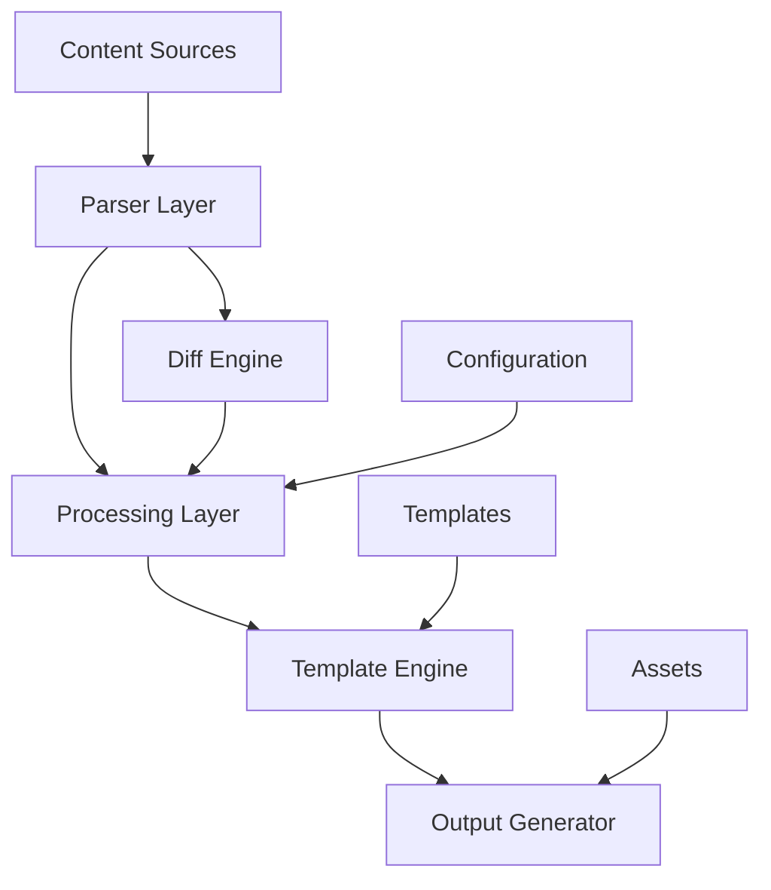
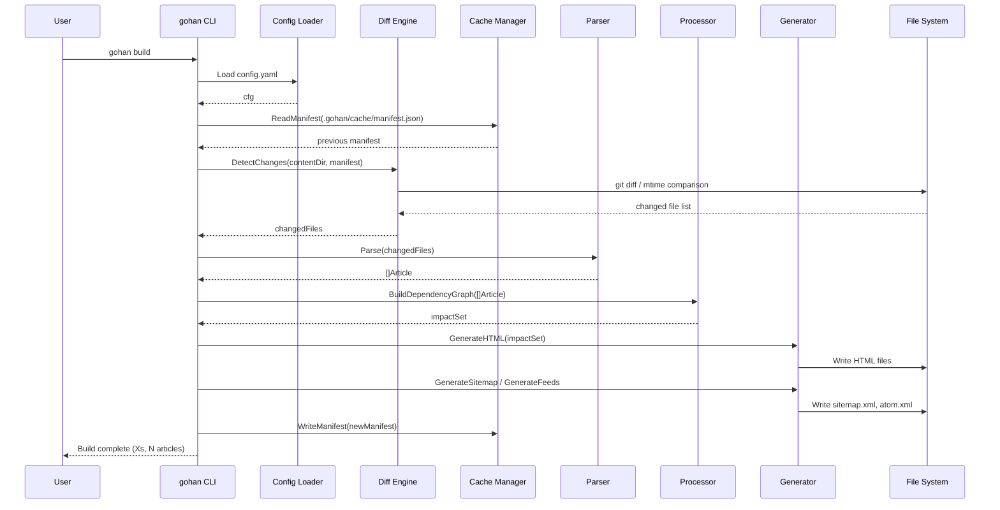
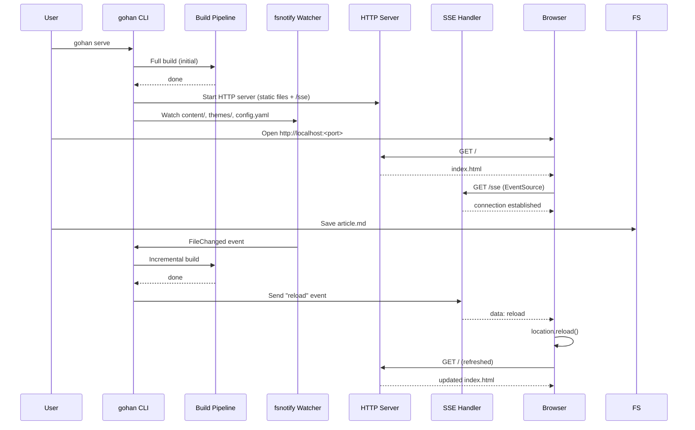
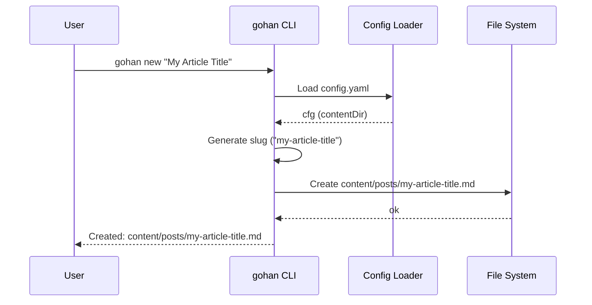

# Design Document: Gohan - Go-based SSG

## 1. Background & Motivation

### Why Build a Custom SSG?

Despite the existence of many static site generators such as Hugo, Jekyll, Gatsby, and Next.js, we chose to build our own for the following reasons:

- **Pursuit of simplicity**: Existing tools are feature-rich but excessive for personal blogs
- **Leveraging Go**: Taking advantage of Go's concurrency performance and simplicity
- **Optimized differential builds**: Efficient incremental builds for processing large numbers of articles
- **Reduced learning curve**: Avoiding the complex configuration and plugin systems of existing tools to achieve intuitive usability

### Requirements Not Met by Existing Tools

- **Hugo**: Complex configuration with a high learning cost for customization
- **Jekyll**: Ruby dependency results in slow builds
- **Gatsby / Next.js**: The Node.js ecosystem is heavy and excessive for simple blogs

### Design Intent for GitHub-based Content Management

- Leveraging GitHub for version control of Markdown files
- However, to avoid GitHub dependency, the tool also works with the local filesystem
- Naturally enables article history management and collaborative review workflows

---

## 2. Goals

### Primary Goals

- **Provide a simple, fast SSG for personal blogs**
  - Minimal configuration files
  - Reduced build times (differential builds within 30 seconds)
  - Focused on static file generation

### Technical Goals

- **Efficient operation through differential builds**
  - Regenerate only changed articles
  - Automatic impact calculation (tag pages, archive pages, etc.)
  - Minimize build time

- **Ensuring extensibility and maintainability through Go implementation**
  - Plugin architecture
  - Testable code design
  - Clear separation of concerns

---

## 3. Non-goals

The following are out of scope for gohan:

- **Dynamic content generation / Server-side rendering**: gohan is dedicated to pure static file generation
- **Web admin UI (CMS features)**: Content management is done via text editor and Git
- **JavaScript bundling / CSS minification**: This is the responsibility of frontend build tools (e.g., Vite)
- **Automatic image resizing / optimization**: Intended to be handled by CDN or separate tools
- **Authentication / membership / comment backend**: Outside the scope of static files
- **Plugin marketplace**: A plugin API is provided, but no distribution platform will be built

---

## 4. Scope

### Target Users

- **Individual bloggers**: Tech blogs, diaries, portfolio sites
- **Small teams**: Tech blogs, project documentation

### Scale Assumptions

- **Article count**: 500–10,000
- **Build time**: Full build within 5 minutes, differential build within 30 seconds
- **Article size**: Average 3,000–5,000 characters, maximum ~15,000 characters

---

## 5. Directory Structure

### Input Side

```
.
├── config.yaml           # Site configuration
├── content/
│   ├── posts/            # Blog articles (subject to list/tag/archive processing)
│   │   └── my-post.md
│   └── pages/            # Static pages (About, Contact, etc.)
│       └── about.md
├── themes/
│   └── default/
│       └── layouts/      # Template files
│           ├── base.html
│           ├── post.html
│           ├── list.html
│           └── partials/
│               ├── header.html
│               └── footer.html
├── assets/               # Static files such as CSS and images
└── taxonomies/
    ├── tags.yaml         # Tag master
    └── categories.yaml   # Category master
```

### Output Side

```
public/
├── index.html
├── posts/
│   └── my-post/
│       └── index.html
├── pages/
│   └── about/
│       └── index.html
├── tags/
│   └── go/
│       └── index.html
├── categories/
│   └── tech/
│       └── index.html
├── archives/
│   └── 2026/
│       └── 02/
│           └── index.html
├── feed.xml              # RSS 2.0
├── atom.xml              # Atom 1.0
├── sitemap.xml
└── assets/               # Copy of static files
```

### Notes

- The `themes/<name>/` structure allows future theme switching with a single line change in `config.yaml`
- Separating `content/posts/` and `content/pages/` clearly limits the targets for list/tag/archive processing
- Output paths can be overridden with the `slug` Front Matter field

---

## 6. Functional Requirements

### 6.1 Core Features

#### Markdown Processing
- **Markdown parsing**: CommonMark compliant
- **Front Matter support**: YAML-formatted metadata

#### Template Features
- **Template engine**: Uses Go's standard `html/template`
- **Template discovery**: Automatic discovery and loading of user-defined templates
- **Flexible template structure**: Templates can be defined with arbitrary filenames and directory structures
- **Template variables**: Provides article data, site configuration, and navigation information
- **Custom functions**: Helper functions for date formatting, tag link generation, Markdown conversion, etc.
- **Template selection**: Templates can be individually specified via Front Matter

#### Content Management
- **Tag / category management**: Master file-based list management and validation
- **Article list generation**: By date, tag, and category
- **Archive generation**: Monthly archives
- **Static pages**: Static pages such as About and Contact

#### Code Highlighting
- **Syntax highlighting**: Language-specific highlighting for code blocks
- **Line number display**: Optional setting

#### Diagram Support
- **Mermaid diagrams**: Flowcharts, sequence diagrams

#### Feed Generation
- **RSS 2.0**: Full article feed
- **Atom 1.0**: Standards-compliant feed
- **Category feeds**: Per-tag and per-category feeds

### 6.2 CLI Interface

See Section 11 for details. The primary commands are:

```bash
gohan build [--full] [--config=path] [--output=dir]
gohan new <slug>
gohan serve
```

---

## 7. Non-functional Requirements

### 7.1 Performance Requirements

#### Build Performance
- **Initial full build**: 1,000 articles within 5 minutes
- **Differential build**: 10 changes within 30 seconds
- **Parallelism**: Parallel article processing based on CPU count

### 7.2 Scalability

- **Article count**: Stable operation up to 10,000 articles

### 7.3 Reproducibility

- **Deterministic builds**: Guarantees identical output for identical input
- **Cache invalidation**: Accurate detection of file changes
- **Cross-platform**: Identical output on Windows / macOS / Linux

### 7.4 Maintainability & Extensibility

#### Code Quality
- **Test coverage**: 80% or higher
- **Static analysis**: `golangci-lint` (covers `go vet`, `staticcheck`, and `gosec`)
- **Dependencies**: Minimize external dependencies
- **Documentation**: godoc-compliant comments

#### Architecture
- **Separation of concerns**: Parser, Generator, Renderer
- **Interface design**: Testable abstractions
- **Externalized configuration**: YAML configuration file
- **Plugin API**: Interfaces for feature extension

### 7.5 Operability

#### Logging & Monitoring
- **Log format**: Human-readable by default (switchable to JSON with `--log-format=json` option)
- **Log levels**: DEBUG, INFO, WARN, ERROR
- **Metrics**: Build time, number of generated articles, and error count output as a summary to stdout upon build completion
- **Error tracking**: Errors with stack traces

#### Configuration Management
- **Environment-specific configuration**: development / production
- **Configuration validation**: Configuration value checks at startup
- **Default values**: Zero-config operation

### 7.6 Security

- **Input validation**: Validation of Markdown and configuration files
- **Path traversal prevention**: File path normalization
- **Dependency scanning**: Detection of vulnerable dependencies

### 7.7 Portability

- **Cross-platform**: Windows / macOS / Linux support
- **Go-only dependency**: No external runtime required, single binary
- **Binary distribution**: Automated releases and distribution via GoReleaser
- **Package manager support**: Homebrew, Scoop, APT, etc.
- **CI/CD integration**: Automated testing and releases via GitHub Actions

---

## 8. Architecture Overview

### 8.1 System Architecture



### 8.2 Data Flow

#### Input
- **Article files**: `content/posts/*.md`
- **Static pages**: `content/pages/*.md`
- **Configuration**: `config.yaml`
- **Templates**: `themes/default/layouts/`
- **Static assets**: `assets/`

#### Processing Flow

1. **Content Parsing**
   - Reading Markdown files
   - Parsing Front Matter
   - Building the dependency graph

2. **Diff Detection**
   - For Git repositories: Identifying changed files via Git diff
   - For non-Git environments: Identifying changed files via file hash comparison (no differential build; falls back to full build)
   - Calculating the impact scope

3. **Page Generation**
   - Converting Markdown to HTML
   - Applying templates
   - Optimization through parallel processing

4. **Asset Processing**
   - Copying static files
   - Preserving directory structure

5. **Output Placement**
   - Creating directory structure
   - Copying and generating files
   - Generating sitemap and feeds

#### Output
- **HTML files**: Each article and page
- **List pages**: Index, tags, categories
- **Feed files**: RSS, Atom
- **Sitemap**: `sitemap.xml`
- **Static assets**: CSS, images

### 8.3 Component Design

#### Parser Layer
```go
type Parser interface {
    ParseMarkdown(content []byte) (*Article, error)
    ParseFrontMatter(data []byte) (*FrontMatter, error)
    ValidateContent(*Article) error
}
```

#### Processing Layer
```go
type Processor interface {
    BuildDependencyGraph(articles []*Article) *DependencyGraph
    CalculateDiff(oldGraph, newGraph *DependencyGraph) *ChangeSet
    ProcessArticles(articles []*Article) ([]*ProcessedArticle, error)
}
```

#### Template Engine
```go
type TemplateEngine interface {
    // LoadTemplates loads all templates under the theme directory
    LoadTemplates(themePath string) error
    RegisterFunctions(funcMap template.FuncMap) error
    Render(templateName string, data interface{}) ([]byte, error)
    GetAvailableTemplates() []string
}
```

#### Diff Engine
```go
type NodeType int

const (
    NodeTypeArticle  NodeType = iota
    NodeTypeTag
    NodeTypeCategory
    NodeTypeArchive
)

// ChangeSet holds the result of diff detection: lists of modified, added, and deleted file paths.
type ChangeSet struct {
    ModifiedFiles []string
    AddedFiles    []string
    DeletedFiles  []string
}

type DiffEngine interface {
    // Passing empty strings for fromCommit/toCommit returns the diff since the last build
    DetectChanges(fromCommit, toCommit string) (*ChangeSet, error)
    IsGitRepo() bool
}
```

#### Output Generator
```go
// Site holds site-wide information passed to templates: Config and article list.
type Site struct {
    Config     Config
    Articles   []*ProcessedArticle
    Tags       []Taxonomy
    Categories []Taxonomy
}

type OutputGenerator interface {
    Write(articles []*ProcessedArticle, site *Site) error
    CopyAssets(srcDir, dstDir string) error
    GenerateSitemap(pages []string) error
    GenerateFeeds(articles []*ProcessedArticle) error
}
```

---

## 9. Data Model Design

### 9.1 Article Data Structure

`Article` is the raw data read from a file. `ProcessedArticle` holds derived data generated at build time.

```go
// Article: input data generated by the parser
type Article struct {
    FrontMatter  FrontMatter `yaml:"frontmatter"`
    RawContent   string      `yaml:"raw_content"`
    FilePath     string      `yaml:"file_path"`
    LastModified time.Time   `yaml:"last_modified"`
}

// ProcessedArticle: derived data generated by the renderer at build time
type ProcessedArticle struct {
    Article
    HTMLContent template.HTML
    Summary     string
    OutputPath  string
}

type FrontMatter struct {
    Title       string    `yaml:"title"`
    Date        time.Time `yaml:"date"`
    Draft       bool      `yaml:"draft"`
    Tags        []string  `yaml:"tags"`
    Categories  []string  `yaml:"categories"`
    Description string    `yaml:"description"`
    Author      string    `yaml:"author"`
    Slug        string    `yaml:"slug"`
}
```

### 9.2 Taxonomy System

`TaxonomyRegistry` is the master data loaded from `tags.yaml` / `categories.yaml`. The `Type` field is not held because it is clear from the structure of the registry.

```go
type Taxonomy struct {
    Name        string `yaml:"name"`
    Description string `yaml:"description"`
}

type TaxonomyRegistry struct {
    Tags       []Taxonomy `yaml:"tags"`
    Categories []Taxonomy `yaml:"categories"`
}
```

### 9.3 Site Configuration

Define the `Config` type to match the top-level structure of `config.yaml`, containing `SiteConfig` and other types within it.

```go
type Config struct {
    Site    SiteConfig             `yaml:"site"`
    Build   BuildConfig            `yaml:"build"`
    Theme   ThemeConfig            `yaml:"theme"`
    Plugins map[string]interface{} `yaml:"plugins"`
}

type SiteConfig struct {
    Title       string `yaml:"title"`
    Description string `yaml:"description"`
    BaseURL     string `yaml:"base_url"`
    Language    string `yaml:"language"`
}

type BuildConfig struct {
    ContentDir   string   `yaml:"content_dir"`
    OutputDir    string   `yaml:"output_dir"`
    AssetsDir    string   `yaml:"assets_dir"`
    ExcludeFiles []string `yaml:"exclude_files"`
    Parallelism  int      `yaml:"parallelism"`
}

type ThemeConfig struct {
    Name   string            `yaml:"name"`
    Dir    string            `yaml:"dir"`
    Params map[string]string `yaml:"params"`
}
```

### 9.4 Build Manifest

The build history saved to `.gohan/cache/manifest.json`, used for hash-based diff detection.

```go
type BuildManifest struct {
    Version      string              `json:"version"`       // gohan version
    BuildTime    time.Time           `json:"build_time"`    // time of last build
    LastCommit   string              `json:"last_commit"`   // repository HEAD commit hash at build time
    FileHashes   map[string]string   `json:"file_hashes"`   // input file path -> SHA-256
    Dependencies map[string][]string `json:"dependencies"`  // file path -> list of dependent file paths
    OutputFiles  []OutputFile        `json:"output_files"`  // list of generated output files
}

type OutputFile struct {
    Path         string    `json:"path"`
    Hash         string    `json:"hash"`
    Size         int64     `json:"size"`
    LastModified time.Time `json:"last_modified"`
    ContentType  string    `json:"content_type"`
}
```

---

## 10. Differential Build Strategy

### 10.1 Diff Detection Mechanism

#### Detection Method Selection Logic

1. Check whether the current directory is a Git repository using `git rev-parse --is-inside-work-tree`
2. If it is a Git repository, use **Git diff-based diff detection**
3. If it is not a Git repository, fall back to **file hash-based full build**

> **Note**: The differential build feature requires a Git repository. In non-Git environments, only full builds are supported.

#### Git-based Diff Detection (using `os/exec`)

Calls the `git` command via `os/exec` without using external libraries. This minimizes external dependencies while leveraging all of Git's diff information.

```go
type GitDiffDetector struct {
    repoDir string
}

func (d *GitDiffDetector) DetectChanges(fromCommit, toCommit string) (*ChangeSet, error) {
    out, err := exec.Command(
        "git", "-C", d.repoDir,
        "diff", "--name-status", fromCommit, toCommit,
    ).Output()
    if err != nil {
        return nil, err
    }
    return parseNameStatus(out), nil
}

func IsGitRepo(dir string) bool {
    err := exec.Command("git", "-C", dir, "rev-parse", "--is-inside-work-tree").Run()
    return err == nil
}
```

#### Fallback: File Hash-based Full Build

When not in a Git repository, changed files are identified by comparing file hashes recorded in the build manifest (`.gohan/cache/manifest.json`) with the current file hashes. However, since no dependency graph exists, a full build is performed instead of a differential build.

### 10.2 Impact Scope Calculation

#### Dependency Graph
```go
type DependencyGraph struct {
    nodes map[string]*Node
    edges map[string][]string
}

type Node struct {
    Path         string
    Type         NodeType // NodeTypeArticle, NodeTypeTag, NodeTypeCategory, NodeTypeArchive
    Dependencies []string
    Dependents   []string
    LastModified time.Time
}

func (g *DependencyGraph) CalculateImpact(changedFiles []string) []string {
    impacted := make(map[string]bool)
    for _, file := range changedFiles {
        g.traverseDependents(file, impacted)
    }
    result := make([]string, 0, len(impacted))
    for k := range impacted {
        result = append(result, k)
    }
    return result
}
```

#### Impact Scope Examples
- **Update Article A** → Article A, tag pages, category pages, archive pages, RSS
- **Update tag master** → All tag pages, related article pages, navigation
- **Update templates** → All pages (full build)

### 10.3 Cache Strategy

#### Cache Storage Location

```
.gohan/
└── cache/
    ├── manifest.json     # File hashes, dependencies, and output file list
    ├── ast/              # Parsed Markdown AST (gob format)
    └── html/             # Rendered HTML
```

`.gohan/` is automatically generated in the project root. When `.gohan/` is created on the first `gohan build` run, a message is displayed recommending that it be added to `.gitignore`.

#### Build Cache
- **Parsed Markdown**: Parsed AST saved in gob format to `.gohan/cache/ast/`
- **Rendered HTML**: Template-applied HTML saved to `.gohan/cache/html/`

#### Cache Invalidation
- **File changes**: Invalidate the corresponding cache when a file's SHA-256 hash changes
- **Dependency changes**: Bulk-invalidate caches within the impact scope
- **Configuration changes**: Clear all caches when the hash of `config.yaml` changes

---

## 11. CLI Specification

### 11.1 Basic Commands

#### build - Site Build
```bash
# Basic build (differential)
gohan build

# Full build
gohan build --full

# Specify configuration file
gohan build --config=config.production.yaml

# Specify output directory
gohan build --output=dist

# Specify parallelism
gohan build --parallel=8

# Dry run
gohan build --dry-run
```

#### new - Article Skeleton Generation
```bash
# Generate a new article (created under content/posts/)
gohan new my-first-post

# Specify a title
gohan new --title="My First Post" my-first-post

# Generate as a static page
gohan new --type=page about
```

#### serve - Local Development Server
```bash
# Start on default port (1313)
gohan serve

# Specify port
gohan serve --port=8080

# Specify host
gohan serve --host=0.0.0.0 --port=8080
```

### 11.2 Configuration Files

#### Global Configuration
```yaml
# ~/.gohan/config.yaml
defaults:
  theme: default
```

#### Project Configuration
```yaml
# config.yaml
site:
  title: "My Blog"
  description: "A personal blog"
  base_url: "https://example.com"
  language: "en"

build:
  content_dir: "content"
  output_dir: "public"
  assets_dir: "assets"
  parallelism: 4

theme:
  name: "default"
  dir: "themes/default"
```

---

## 12. Development Server

### 12.1 Overview

A local HTTP server for development launched by `gohan serve`. Uses Go's standard `net/http` for file serving. Uses the external library `fsnotify` for file change detection (a development server-only dependency).

### 12.2 Basic Specification

```go
// FileWatcher is the file change detection interface. The implementation uses fsnotify.
type FileWatcher interface {
    Add(path string) error
    Events() <-chan string
    Close() error
}

type DevServer struct {
    Host    string
    Port    int
    OutDir  string
    Watcher FileWatcher
}

func (s *DevServer) Start() error {
    // Serve public/ as static files
    fs := http.FileServer(http.Dir(s.OutDir))
    mux := http.NewServeMux()
    mux.Handle("/", fs)
    return http.ListenAndServe(fmt.Sprintf("%s:%d", s.Host, s.Port), mux)
}
```

### 12.3 File Change Detection and Live Reload

- **Change detection**: Use `fsnotify` to watch `content/`, `themes/`, and `assets/`
- **Differential build integration**: Automatically run a differential build upon change detection
- **Live reload**: Notify the browser via SSE (Server-Sent Events) after build completion for automatic reload
- **Injection method**: Dynamically append a `<script>` snippet to each HTML response (output files are not modified)

### 12.4 Operation Flow

```
File change
  → Detected by fsnotify
  → Run differential build
  → Notify browser via SSE
  → Browser reloads
```

---

## 13. Binary Distribution & Release Strategy

Automated releases using GoReleaser.

### 13.1 Distribution Channels
- **GitHub Releases**: Binaries for all platforms
- **Go Install**: `go install github.com/bmf-san/gohan@latest`

### 13.2 Release Workflow
1. **Release notes**: Automatically generated and GitHub Release created
2. **Automated build**: GoReleaser executed via GitHub Actions
3. **Artifact generation**: Binaries for each platform

---

## 14. Testing Strategy

### 14.1 Unit Tests

Target components and test perspectives:

| Component | Test Perspectives |
|---|---|
| Markdown parser | CommonMark-compliant conversion, edge cases |
| Front Matter parser | YAML parsing, errors on missing required fields |
| Dependency graph | Node addition, edge addition, accuracy of impact scope calculation |
| Template engine | Variable expansion, custom functions, error template handling |
| Diff detection | Accurate detection of modified/added/deleted files |
| Configuration loader | YAML parsing, validation, default value application |

### 14.2 Integration Tests

- **Full build test**: Verify HTML output in `public/` using fixture content and templates as input
- **Differential build test**: Confirm that only files within the impact scope are updated after rebuilding with partial file changes
- **CLI test**: Verify exit codes, stdout, and stderr for each subcommand

### 14.3 Test Fixture Structure

```
testdata/
├── content/
│   ├── posts/
│   │   ├── simple-post.md        # Basic article
│   │   ├── post-with-tags.md     # Article with tags
│   │   └── draft-post.md         # Article with draft: true
│   └── pages/
│       └── about.md
├── themes/
│   └── test/
│       └── layouts/
│           └── base.html
├── config.yaml
└── expected/                      # Snapshot of expected HTML output
    └── public/
```

### 14.4 Coverage Goals

- **Overall**: 80% or higher
- **Parser / renderer layer**: 90% or higher (priority testing for core logic)
- Run `go test -cover` in CI and fail the build if below the threshold

---

## 15. Technical Debt Management

### 15.1 Continuous Quality Management

- **Dependency updates**: dependabot automatically creates PRs on a weekly basis
- **Static analysis & testing**: Run `golangci-lint` and `go test -race -cover` in CI for every PR
- **Coverage threshold**: Verify `go test -coverprofile` results with a script and fail CI if below 80%

### 15.2 Performance Monitoring

- **Benchmarks**: Measure processing time for parser, renderer, and differential build using `go test -bench`
- **Regression detection**: Record benchmark result comparisons against the previous run in CI and alert on significant degradation

### 15.3 Known Limitations

- Live reload in `gohan serve` depends on `fsnotify`, so event detection may not work in some NFS or Docker volume environments
- Git calls via `os/exec` do not work in environments where Git is not installed (only affects differential builds; full builds still work)

---

## 16. Use Cases

### UC-1: Build a site (incremental)

**Actor**: Developer  
**Precondition**: `config.yaml` exists; at least one Markdown article exists  
**Trigger**: Run `gohan build`

**Main Flow**:
1. gohan loads `config.yaml` and resolves the project root.
2. gohan reads the diff manifest (`.gohan/cache/manifest.json`) from the previous build.
3. gohan calls `git diff` to detect which Markdown files have changed since the last build.
4. gohan parses only the changed articles (Front Matter + Markdown -> HTML).
5. gohan calculates the impact set (tag pages, category pages, archive page, index page, sitemap, feed).
6. gohan renders the impact set through the template engine and writes HTML files to the output directory.
7. gohan updates the manifest and prints a build summary (elapsed time, article count).

**Alternative Flow - no Git repo**:  
Step 3 falls back to comparing file modification times against the manifest.

**Postcondition**: Output directory contains up-to-date HTML, `sitemap.xml`, and `atom.xml`.

---

### UC-2: Force a full build

**Actor**: Developer  
**Trigger**: Run `gohan build --full`

**Main Flow**:  
Same as UC-1 except steps 2-3 are skipped; all articles are treated as changed.

**Postcondition**: All HTML is regenerated from scratch; manifest is rewritten.

---

### UC-3: Create a new article

**Actor**: Developer  
**Trigger**: Run `gohan new "My Article Title"`

**Main Flow**:
1. gohan reads `config.yaml` to determine the content directory.
2. gohan generates a slug from the title (lowercase, spaces -> hyphens).
3. gohan creates `content/posts/<slug>.md` with a pre-filled Front Matter template (title, date, draft: true).
4. gohan prints the path of the created file.

**Postcondition**: A new Markdown file is ready for editing; it is marked `draft: true` so it is excluded from builds until published.

---

### UC-4: Start the development server

**Actor**: Developer  
**Trigger**: Run `gohan serve`

**Main Flow**:
1. gohan performs an initial full build into a temporary output directory.
2. gohan starts an HTTP server serving the output directory.
3. gohan starts a file watcher (`fsnotify`) on the content, theme, and config directories.
4. The developer opens `http://localhost:<port>` in a browser; the browser connects to the SSE endpoint (`/sse`).
5. The developer saves a Markdown file.
6. gohan detects the change, runs an incremental build, and sends a `reload` event via SSE.
7. The browser reloads the page automatically.

**Postcondition**: The browser always reflects the latest content without manual refresh.

---

### UC-5: Publish an article

**Actor**: Developer  
**Trigger**: Edit Front Matter of a draft article and change `draft: false`, then run `gohan build`

**Main Flow**:  
Same as UC-1. Because the article file changed (or `--full` is used), it is now included in the build output.

**Postcondition**: The article appears in the generated HTML, tag/category pages, archive, sitemap, and feed.

---

## 17. Sequence Diagrams

### 17.1 Incremental Build (`gohan build`)



---

### 17.2 Development Server & Live Reload (`gohan serve`)



---

### 17.3 New Article Creation (`gohan new`)


