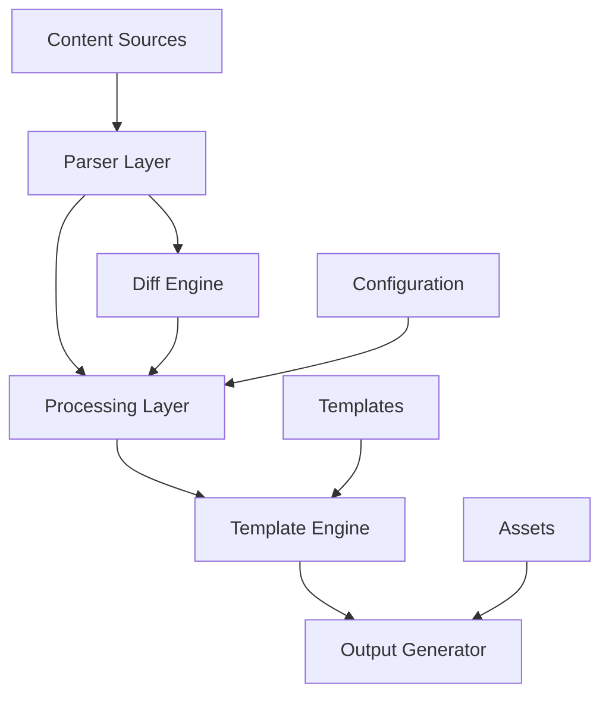

# Design Document: Gohan - Go-based Static Site Generator

## 1. Background / Motivation

### Why Implement a Custom SSG?

While the static site generator market offers many options like Hugo, Jekyll, Gatsby, and Next.js, we choose to implement our own for the following reasons:

- **Pursuit of Simplicity**: Existing tools are often feature-rich but excessive for personal blogs
- **Leveraging Go**: Utilize Go's concurrency performance and simplicity
- **Optimized Differential Builds**: Efficient differential build functionality for processing large numbers of articles
- **Learning Cost**: Avoid complex configurations and plugin systems of existing tools, achieving intuitive usability

### Requirements Not Met by Existing Tools

- **Hugo**: Complex configuration with high learning cost for customization
- **Jekyll**: Ruby dependency with slow build speeds
- **Gatsby/Next.js**: Heavy Node.js ecosystem, excessive for simple blogs

### GitHub Article Storage Design Intent

- Utilize GitHub as a management and version control foundation for Markdown files
- However, also operate on local filesystem to avoid GitHub dependency
- Naturally implement article history management and collaborative article review workflows

---

## 2. Goals

### Primary Objectives

- **Provide a simple and fast SSG for personal blogs**
  - Minimal configuration files
  - Reduced build time (within seconds for differential builds)
  - Focus on static file generation

### Technical Goals

- **Efficient operation through differential builds**
  - Regenerate only changed articles
  - Automatically calculate impact scope (tag pages, archive pages, etc.)
  - Minimize build time

- **Go implementation ensuring extensibility and maintainability**
  - Plugin architecture
  - Testable code design
  - Clear separation of responsibilities

---

## 3. Scope

### Target Users

- **Individual Bloggers**: Technical blogs, personal diaries, portfolio sites
- **Small Teams**: Development team tech blogs, project documentation

### Scale Assumptions

- **Article Count**: 500-10,000 articles
- **Build Time**: Full build within 5 minutes, differential build within 30 seconds
- **Article Size**: Average 3,000-5,000 characters per article, maximum around 15,000 characters

---

## 4. Functional Requirements

### 4.1 Core Features

#### Markdown Processing
- **Markdown Parsing**: CommonMark compliance
- **Front Matter Support**: YAML format metadata

#### Template Features
- **Template Engine**: Using Go standard `html/template`
- **Template Discovery**: Automatic discovery and loading of user-defined templates
- **Flexible Template Structure**: Users can define with arbitrary filenames and directory structures
- **Template Variables**: Provide article data, site configuration, and navigation information
- **Custom Functions**: Helper functions for date formatting, tag link generation, Markdown conversion, etc.
- **Template Selection**: Support for individual template specification via Front Matter

#### Content Management
- **Tag/Category Management**: Master file listing management and validation
- **Article List Generation**: By date, tags, categories
- **Archive Generation**: Monthly archives
- **Static Pages**: About, Contact, and other static pages

#### Code Highlighting
- **Syntax Highlighting**: Language-specific highlighting for code blocks
- **Line Numbers**: Optional setting

#### Diagram Support
- **Mermaid Diagrams**: Flowcharts, sequence diagrams

#### Feed Generation
- **RSS 2.0**: Full article feed
- **Atom 1.0**: Standards-compliant feed
- **Category-specific Feeds**: Feeds by tags and categories

### 4.3 CLI Interface

```bash
# Build commands
gohan build [--full|--diff] [--config=path] [--output=dir]
```

---

## 5. Non-Functional Requirements

### 5.1 Performance Requirements

#### Build Performance
- **Initial Full Build**: 1,000 articles within 5 minutes
- **Differential Build**: 10 changed articles within 30 seconds
- **Parallel Processing**: Parallel article processing according to CPU count

### 5.2 Scalability

- **Article Count**: Stable operation up to 10,000 articles

### 5.3 Reproducibility

- **Deterministic Build**: Guarantee same output for same input
- **Cache Invalidation**: Accurate detection of file changes
- **Cross-platform**: Identical output across Windows/macOS/Linux

### 5.4 Maintainability & Extensibility

#### Code Quality
- **Test Coverage**: 80% or higher
- **Static Analysis**: golint, go vet, gosec
- **Dependencies**: Minimize external dependencies
- **Documentation**: godoc-compliant comments

#### Architecture
- **Separation of Concerns**: Parser, Generator, Renderer
- **Interface Design**: Testable abstractions
- **Configuration Externalization**: YAML configuration files
- **Plugin API**: Interface for feature extensions

### 5.5 Operability

#### Logging & Monitoring
- **Structured Logging**: JSON format log output
- **Log Levels**: DEBUG, INFO, WARN, ERROR
- **Metrics**: Build time, article count, error count
- **Error Tracking**: Errors with stack traces

#### Configuration Management
- **Environment-specific Configuration**: development, production
- **Configuration Validation**: Startup configuration value checks
- **Default Values**: Zero-configuration operation

### 5.6 Security

- **Input Validation**: Validation of Markdown and configuration files
- **Path Traversal Prevention**: File path normalization
- **Credential Management**: Environment variables, configuration file separation
- **Dependency Scanning**: Detection of vulnerable dependencies

### 5.7 Portability

- **Cross-platform**: Windows/macOS/Linux support
- **Go-only Dependencies**: No external runtime required, single binary
- **Binary Distribution**: Automatic release and distribution via GoReleaser
- **Package Manager Support**: Homebrew, Scoop, APT, etc.
- **CI/CD Integration**: GitHub Actions, automated testing and releases

---

## 6. Architecture Overview

### 6.1 System Architecture



### 6.2 Data Flow

#### Input
- **Article Files**: `content/posts/*.md`
- **Static Pages**: `content/pages/*.md`
- **Configuration**: `config.yaml`
- **Templates**: `themes/default/layouts/`
- **Static Assets**: `assets/`

#### Processing Flow

1. **Content Analysis**
   - Load Markdown files
   - Parse Front Matter
   - Build dependency graph

2. **Differential Detection**
   - Get Git commit differences
   - File system monitoring (during development)
   - Calculate impact scope

3. **Page Generation**
   - Convert Markdown to HTML
   - Apply templates
   - Optimization through parallel processing

4. **Asset Processing**
   - Copy static files
   - Preserve directory structure

5. **Output Placement**
   - Create directory structure
   - Copy and generate files
   - Generate sitemap and feeds

#### Output
- **HTML Files**: Each article and page
- **List Pages**: Index, tags, categories
- **Feed Files**: RSS, Atom
- **Sitemap**: `sitemap.xml`
- **Static Assets**: CSS, images

### 6.3 Component Design

#### Parser Layer
```go
type Parser interface {
    ParseMarkdown(content []byte) (*Article, error)
    ParseFrontMatter(data []byte) (*FrontMatter, error)
    ValidateContent(*Article) error
}
```

#### Processing Layer
```go
type Processor interface {
    BuildDependencyGraph(articles []*Article) *Graph
    CalculateDiff(oldGraph, newGraph *Graph) *DiffResult
    ProcessArticles(articles []*Article) ([]*ProcessedArticle, error)
}
```

#### Template Engine
```go
type TemplateEngine interface {
    LoadTemplates(themePath string) error
    LoadUserTemplates(templatePaths []string) error
    RegisterFunctions(funcMap template.FuncMap) error
    Render(templateName string, data interface{}) ([]byte, error)
    GetAvailableTemplates() []string
}
```

---

## 7. Data Model Design

### 7.1 Article Data Structure

```go
type Article struct {
    // Metadata
    FrontMatter FrontMatter `yaml:"frontmatter"`

    // Content
    RawContent    string        `json:"raw_content"`
    HTMLContent   template.HTML `json:"html_content"`
    Summary       string        `json:"summary"`

    // File Information
    FilePath     string    `json:"file_path"`
    LastModified time.Time `json:"last_modified"`

    // Generation Information
    OutputPath   string   `json:"output_path"`
}

type FrontMatter struct {
    Title       string    `yaml:"title"`
    Date        time.Time `yaml:"date"`
    Draft       bool      `yaml:"draft"`
    Tags        []string  `yaml:"tags"`
    Categories  []string  `yaml:"categories"`
    Description string    `yaml:"description"`
    Author      string    `yaml:"author"`
    Slug        string    `yaml:"slug"`
}
```

### 7.2 Taxonomy System

```go
type Taxonomy struct {
    Type        string            `yaml:"type"` // "tags" or "categories"
    Name        string            `yaml:"name"`
    Description string            `yaml:"description"`
}

type TaxonomyRegistry struct {
    Tags       []Taxonomy `yaml:"tags"`
    Categories []Taxonomy `yaml:"categories"`
}
```

### 7.3 Site Configuration

```go
type SiteConfig struct {
    // Basic Information
    Title       string `yaml:"title"`
    Description string `yaml:"description"`
    BaseURL     string `yaml:"base_url"`
    Language    string `yaml:"language"`

    // Build Configuration
    Build BuildConfig `yaml:"build"`

    // Theme Configuration
    Theme ThemeConfig `yaml:"theme"`

    // Plugin Configuration
    Plugins map[string]interface{} `yaml:"plugins"`
}

type BuildConfig struct {
    ContentDir   string   `yaml:"content_dir"`
    OutputDir    string   `yaml:"output_dir"`
    ThemeDir     string   `yaml:"theme_dir"`
    AssetsDir    string   `yaml:"assets_dir"`
    ExcludeFiles []string `yaml:"exclude_files"`
    Parallelism  int      `yaml:"parallelism"`
}
```

### 7.4 Build Manifest

```go
type BuildManifest struct {
    Version     string               `json:"version"`
    BuildTime   time.Time            `json:"build_time"`
    GitCommit   string               `json:"git_commit"`
    FileHashes  map[string]string    `json:"file_hashes"`
    Dependencies map[string][]string `json:"dependencies"`
    OutputFiles []OutputFile         `json:"output_files"`
}

type OutputFile struct {
    Path         string    `json:"path"`
    Hash         string    `json:"hash"`
    Size         int64     `json:"size"`
    LastModified time.Time `json:"last_modified"`
    ContentType  string    `json:"content_type"`
}
```

---

## 8. Differential Build Strategy

### 8.1 Differential Detection Mechanism

#### Git Diff-based
```go
type GitDiffDetector struct {
    repo *git.Repository
}

func (d *GitDiffDetector) DetectChanges(fromCommit, toCommit string) (*ChangeSet, error) {
    // Get Git diff
    diff, err := d.repo.Diff(fromCommit, toCommit)
    if err != nil {
        return nil, err
    }

    return &ChangeSet{
        ModifiedFiles: extractModified(diff),
        AddedFiles:    extractAdded(diff),
        DeletedFiles:  extractDeleted(diff),
    }, nil
}
```

### 8.2 Impact Scope Calculation

#### Dependency Graph
```go
type DependencyGraph struct {
    nodes map[string]*Node
    edges map[string][]string
}

type Node struct {
    Path         string
    Type         NodeType // Article, Tag, Category, Archive
    Dependencies []string
    Dependents   []string
    LastModified time.Time
}

func (g *DependencyGraph) CalculateImpact(changedFiles []string) []string {
    impacted := make(map[string]bool)

    for _, file := range changedFiles {
        g.traverseDependents(file, impacted)
    }

    return keys(impacted)
}
```

#### Impact Scope Examples
- **Update Article A** → Article A, tag pages, category pages, archive pages, RSS
- **Update Tag Master** → All tag pages, relevant article pages, navigation
- **Update Templates** → All pages (full build)

### 8.3 Cache Strategy

#### Build Cache
- **Parsed Markdown**: Cache of parsed AST
- **Rendered HTML**: HTML after template application

#### Cache Invalidation
- **File Changes**: Hash-based invalidation
- **Dependency Changes**: Bulk invalidation of impact scope
- **Configuration Changes**: Clear all cache

---

## 9. CLI Specification

### 9.1 Basic Commands

#### build - Site Build
```bash
# Basic build (differential)
gohan build

# Full build
gohan build --full

# Specify configuration file
gohan build --config=config.production.yaml

# Specify output directory
gohan build --output=dist

# Specify parallelism
gohan build --parallel=8

# Dry run
gohan build --dry-run
```

### 9.6 Configuration Files

#### Global Configuration
```yaml
# ~/.gohan/config.yaml
defaults:
  theme: default
  editor: code
```

#### Project Configuration
```yaml
# config.yaml
site:
  title: "My Blog"
  description: "A personal blog"
  base_url: "https://example.com"

build:
  content_dir: "content"
  output_dir: "public"
  parallelism: 4
```

---

### 10. Binary Distribution & Release Strategy
- Automatic releases via GoReleaser

#### Distribution Channels
- **GitHub Releases**: Binaries for all platforms
- **Go Install**: `go install github.com/bmf-san/gohan@latest`

#### Release Workflow
1. **Release Notes**: Auto-generation and GitHub Release creation
2. **Automated Build**: GoReleaser execution via GitHub Actions
3. **Artifact Generation**: Binaries for each platform

### 11. Technical Debt Management

- **Dependency Updates**: PR creation via dependabot
- **Performance Measurement**: Benchmark execution
- **Code Quality**: Automated static analysis and testing
