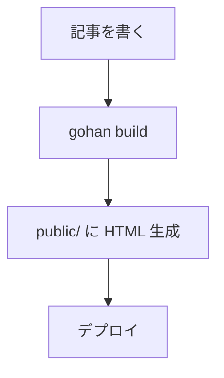

# テンプレートガイド

gohan のテーマは Go 標準ライブラリの `html/template` を使用します。

> English version: [templates.md](templates.md)

---

## テンプレートファイル

テーマディレクトリ（デフォルト: `themes/default/templates/`）にある `.html` ファイルが自動的に読み込まれます。

### 利用可能なページテンプレート

| ファイル | URL パターン | 説明 |
|---|---|---|
| `index.html` | `/` | サイトのトップページ（全記事一覧） |
| `article.html` | `/posts/<slug>/` | 個別記事ページ |
| `tag.html` | `/tags/<name>/` | タグ別記事一覧ページ |
| `category.html` | `/categories/<name>/` | カテゴリー別記事一覧ページ |
| `archive.html` | `/archive/<year>/` | 年別アーカイブページ |

> テンプレートファイルはすべて任意です。存在しない場合、そのページは生成されません（エラーにはなりません）。

---

## テンプレートデータ

すべてのテンプレートに `model.Site` 型の値が渡されます。

### Site

```go
type Site struct {
    Config          Config              // config.yaml の設定
    Articles        []*ProcessedArticle // ページに対応する記事一覧（絞り込み済み）
    Tags            []Taxonomy          // サイト全体のタグ一覧
    Categories      []Taxonomy          // サイト全体のカテゴリー一覧
    Pagination      *Pagination         // ページング情報。ページネーション無効または一覧ページ以外は nil
    CurrentLocale   string              // 現在ページのロケールコード（例: "en", "ja"）。i18n 未設定時は空
    RelatedArticles []*ProcessedArticle // 現在記事と同一カテゴリーを持つ関連記事（記事ページのみ。他ページは nil）
}
```

### Pagination

```go
type Pagination struct {
    CurrentPage int
    TotalPages  int
    PerPage     int
    TotalItems  int
    PrevURL     string // 前ページなし = 空文字
    NextURL     string // 次ページなし = 空文字
    BaseURL     string // PrevURL / NextURL 生成に使う URL プレフィックス
}
```

詳細は [docs/features/pagination.ja.md](../features/pagination.ja.md) を参照してください。

### ProcessedArticle

```go
type ProcessedArticle struct {
    FrontMatter  FrontMatter    // YAML Front Matter
    HTMLContent  template.HTML  // レンダリング済み HTML
    Summary      string         // 先頭 200 文字の要約
    OutputPath   string         // 出力ファイルパス
    FilePath     string         // ソース Markdown ファイルパス
    LastModified time.Time      // 最終更新日時
    ContentPath  string         // コンテンツディレクトリからの相対パス（例: "posts/hello.md"）。GitHub 編集リンクに使用
    Locale       string         // ロケールコード（例: "en", "ja"）。i18n 未設定時は空
    URL          string         // 正規 URL パス（例: "/posts/hello/" または "/ja/posts/hello/"）
    Translations []LocaleRef    // 翻訳バリアント。BuildTranslationMap 後に設定。i18n 未設定時は空
    PluginData   map[string]interface{} // プラグインが注入する記事別データ。{{index .PluginData "plugin_name"}} でアクセス
}

// LocaleRef はある翻訳バリアントのロケールコードと URL を保持する。
type LocaleRef struct {
    Locale string
    URL    string
}

type FrontMatter struct {
    Title          string
    Date           time.Time
    Draft          bool
    Tags           []string
    Categories     []string
    Description    string
    Author         string
    Slug           string
    Template       string
    TranslationKey string                 // 他ロケールの翻訳記事と紐付けるキー
    Extra          map[string]interface{} // 上記以外のフロントマターキー。プラグインが利用
}
```

### Taxonomy

```go
type Taxonomy struct {
    Name        string // タグ/カテゴリー名
    Description string // 説明（任意）
}
```

---

## ページ別の `.Articles` の内容

| テンプレート | `.Articles` の内容 | 追加フィールド |
|---|---|---|
| `index.html` | サイト全体の全記事 | `.Pagination` |
| `article.html` | その記事 1 件のみ | `.RelatedArticles`、`.CurrentLocale` |
| `tag.html` | そのタグを持つ記事 | `.Pagination` |
| `category.html` | そのカテゴリーを持つ記事 | `.Pagination` |
| `archive.html` | その年の記事 | — |

> **`article.html` の注意:** `{{range .Articles}}` ループの内側では `$` でルートフィールドにアクセスします。例: `$.RelatedArticles`、`$.CurrentLocale`、`$.Config`。

---

## 組み込み関数

| 関数 | 使用例 | 説明 |
|---|---|---|
| `formatDate` | `{{formatDate "2006-01-02" .FrontMatter.Date}}` | 日付フォーマット |
| `tagURL` | `{{tagURL "go"}}` → `/tags/go/` | タグページの URL |
| `categoryURL` | `{{categoryURL "tech"}}` → `/categories/tech/` | カテゴリーページの URL |
| `markdownify` | `{{markdownify "**bold**"}}` | Markdown を HTML に変換 |

`formatDate` のレイアウト文字列は [Go の time フォーマット](https://pkg.go.dev/time#Layout) に従います:

- `"2006-01-02"` → `2024-01-15`
- `"January 2, 2006"` → `January 15, 2024`
- `"2006年1月2日"` → `2024年1月15日`

---

## テンプレートの例

詳細なテンプレート例は英語版 [templates.md](templates.md) に記載されています。

### `index.html` — トップページ

```html
<!DOCTYPE html>
<html lang="{{.Config.Site.Language}}">
<head>
  <meta charset="UTF-8">
  <meta name="description" content="{{.Config.Site.Description}}">
  <title>{{.Config.Site.Title}}</title>
  <link rel="stylesheet" href="/assets/style.css">
  <link rel="alternate" type="application/atom+xml" title="{{.Config.Site.Title}}" href="/atom.xml">
</head>
<body>
  <header>
    <h1><a href="/">{{.Config.Site.Title}}</a></h1>
  </header>
  <main>
    <ul>
      {{range .Articles}}
      <li>
        <time>{{formatDate "2006年1月2日" .FrontMatter.Date}}</time>
        <a href="/posts/{{.FrontMatter.Slug}}/">{{.FrontMatter.Title}}</a>
      </li>
      {{end}}
    </ul>
  </main>
  <footer>
    <a href="/sitemap.xml">Sitemap</a> · <a href="/atom.xml">Feed</a>
  </footer>
</body>
</html>
```

---

## 高度な機能

### Mermaid 図

Markdown に `mermaid` コードブロックを書くと自動的に図が描画されます:

````text

````

gohan は mermaid ブロックを検出すると Mermaid ランタイムスクリプトを自動挿入します。

### シンタックスハイライト

フェンスコードブロックは [chroma](https://github.com/alecthomas/chroma) により自動的にハイライトされます。スタイルはインライン CSS で適用されるため外部スタイルシートは不要です。

### テンプレートの継承（partials）

`{{define}}` と `{{template}}` を使って再利用可能なパーシャルを作成できます:

```html
<!-- _partials/header.html -->
{{define "header"}}
<header>
  <h1><a href="/">{{.Config.Site.Title}}</a></h1>
</header>
{{end}}
```

```html
<!-- index.html -->
<!DOCTYPE html>
<html>
<body>
  {{template "header" .}}
  <main>...</main>
</body>
</html>
```
