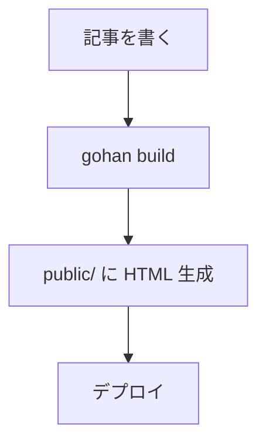

# Template Guide — テンプレートガイド

gohan のテーマは Go 標準ライブラリの `html/template` を使用します。

---

## テンプレートファイル

テーマディレクトリ（デフォルト: `themes/default/templates/`）にある `.html` ファイルが自動的に読み込まれます。

### 必須テンプレート

| ファイル | URL パターン | 説明 |
|---|---|---|
| `index.html` | `/` | サイトのトップページ（全記事一覧） |
| `article.html` | `/posts/<slug>/` | 個別記事ページ |
| `tag.html` | `/tags/<name>/` | タグ別記事一覧ページ |
| `category.html` | `/categories/<name>/` | カテゴリー別記事一覧ページ |
| `archive.html` | `/archive/<year>/` | 年別アーカイブページ |

> **注意**: テンプレートが存在しない場合、そのページは生成されません（エラーにはなりません）。

---

## テンプレートデータ

すべてのテンプレートに `model.Site` 型の値が渡されます。

### Site

```go
type Site struct {
    Config     Config              // config.yaml の設定
    Articles   []*ProcessedArticle // ページに対応する記事一覧（絞り込み済み）
    Tags       []Taxonomy          // サイト全体のタグ一覧
    Categories []Taxonomy          // サイト全体のカテゴリー一覧
}
```

### Config

```go
type Config struct {
    Site  SiteConfig  // .Config.Site.*
    Theme ThemeConfig // .Config.Theme.*
    Build BuildConfig // .Config.Build.*
}

type SiteConfig struct {
    Title       string // .Config.Site.Title
    Description string // .Config.Site.Description
    BaseURL     string // .Config.Site.BaseURL
    Language    string // .Config.Site.Language
}

type ThemeConfig struct {
    Name   string            // .Config.Theme.Name
    Dir    string            // .Config.Theme.Dir
    Params map[string]string // .Config.Theme.Params
}
```

### ProcessedArticle

```go
type ProcessedArticle struct {
    FrontMatter FrontMatter    // YAML Front Matter
    HTMLContent template.HTML  // レンダリング済み HTML
    Summary     string         // 先頭 200 文字の要約
    OutputPath  string         // 出力ファイルパス
    FilePath    string         // ソース Markdown ファイルパス
    LastModified time.Time     // 最終更新日時
}

type FrontMatter struct {
    Title       string
    Date        time.Time
    Draft       bool
    Tags        []string
    Categories  []string
    Description string
    Author      string
    Slug        string
    Template    string
}
```

### Taxonomy

```go
type Taxonomy struct {
    Name        string // タグ/カテゴリー名
    Description string // 説明（任意）
}
```

---

## ページ別の `.Articles` の内容

各テンプレートで `.Articles` に含まれる記事は異なります:

| テンプレート | `.Articles` の内容 |
|---|---|
| `index.html` | サイト全体の全記事 |
| `article.html` | その記事 1 件のみ |
| `tag.html` | そのタグを持つ記事 |
| `category.html` | そのカテゴリーを持つ記事 |
| `archive.html` | その年の記事 |

---

## 組み込み関数

| 関数 | 使用例 | 説明 |
|---|---|---|
| `formatDate` | `{{formatDate "2006-01-02" .FrontMatter.Date}}` | 日付フォーマット |
| `tagURL` | `{{tagURL "go"}}` → `/tags/go/` | タグページの URL |
| `categoryURL` | `{{categoryURL "tech"}}` → `/categories/tech/` | カテゴリーページの URL |
| `markdownify` | `{{markdownify "**bold**"}}` | Markdown を HTML に変換 |

`formatDate` のレイアウト文字列は [Go の time フォーマット](https://pkg.go.dev/time#Layout) に従います:
- `"2006-01-02"` → `2024-01-15`
- `"January 2, 2006"` → `January 15, 2024`
- `"2006年1月2日"` → `2024年1月15日`

---

## テンプレートの例

### `index.html` — トップページ

```html
<!DOCTYPE html>
<html lang="{{.Config.Site.Language}}">
<head>
  <meta charset="UTF-8">
  <meta name="description" content="{{.Config.Site.Description}}">
  <title>{{.Config.Site.Title}}</title>
  <link rel="stylesheet" href="/assets/style.css">
  <link rel="alternate" type="application/atom+xml" title="{{.Config.Site.Title}}" href="/atom.xml">
</head>
<body>
  <header>
    <h1><a href="/">{{.Config.Site.Title}}</a></h1>
    <p>{{.Config.Site.Description}}</p>
  </header>

  <main>
    <h2>最新の記事</h2>
    <ul>
      {{range .Articles}}
      <li>
        <time>{{formatDate "2006-01-02" .FrontMatter.Date}}</time>
        <a href="/posts/{{.FrontMatter.Slug}}/">{{.FrontMatter.Title}}</a>
        {{if .FrontMatter.Tags}}
        <span class="tags">
          {{range .FrontMatter.Tags}}
          <a href="{{tagURL .}}">#{{.}}</a>
          {{end}}
        </span>
        {{end}}
      </li>
      {{end}}
    </ul>
  </main>

  <footer>
    <p><a href="/sitemap.xml">Sitemap</a> · <a href="/atom.xml">Feed</a></p>
    {{if .Config.Theme.Params.footer_text}}
    <p>{{.Config.Theme.Params.footer_text}}</p>
    {{end}}
  </footer>
</body>
</html>
```

### `article.html` — 記事ページ

```html
<!DOCTYPE html>
<html lang="{{.Config.Site.Language}}">
<head>
  <meta charset="UTF-8">
  {{with (index .Articles 0)}}
  <meta name="description" content="{{.FrontMatter.Description}}">
  <title>{{.FrontMatter.Title}} — {{$.Config.Site.Title}}</title>
  {{end}}
  <link rel="stylesheet" href="/assets/style.css">
</head>
<body>
  <header>
    <nav><a href="/">← {{.Config.Site.Title}}</a></nav>
  </header>

  <main>
    {{with (index .Articles 0)}}
    <article>
      <h1>{{.FrontMatter.Title}}</h1>
      <div class="meta">
        <time>{{formatDate "2006年1月2日" .FrontMatter.Date}}</time>
        {{if .FrontMatter.Author}}
        <span> · {{.FrontMatter.Author}}</span>
        {{end}}
      </div>

      {{if .FrontMatter.Tags}}
      <ul class="tags">
        {{range .FrontMatter.Tags}}
        <li><a href="{{tagURL .}}">{{.}}</a></li>
        {{end}}
      </ul>
      {{end}}

      <div class="content">
        {{.HTMLContent}}
      </div>
    </article>
    {{end}}
  </main>
</body>
</html>
```

### `tag.html` — タグ別記事一覧

```html
<!DOCTYPE html>
<html lang="{{.Config.Site.Language}}">
<head>
  <meta charset="UTF-8">
  <title>{{.Config.Site.Title}}</title>
  <link rel="stylesheet" href="/assets/style.css">
</head>
<body>
  <header>
    <nav><a href="/">← {{.Config.Site.Title}}</a></nav>
  </header>
  <main>
    <h2>記事一覧</h2>
    <ul>
      {{range .Articles}}
      <li>
        <time>{{formatDate "2006-01-02" .FrontMatter.Date}}</time>
        <a href="/posts/{{.FrontMatter.Slug}}/">{{.FrontMatter.Title}}</a>
      </li>
      {{end}}
    </ul>
  </main>
</body>
</html>
```

---

## 高度な機能

### Mermaid 図

Markdown にコードブロックを書くだけで Mermaid 図が描画されます:

````markdown

````

テンプレートに Mermaid の CDN スクリプトを含めることで動作します（gohan はレンダリング時に自動挿入することもできます）:

```html
<script src="https://cdn.jsdelivr.net/npm/mermaid/dist/mermaid.min.js"></script>
```

### シンタックスハイライト

````markdown
```go
package main

import "fmt"

func main() {
    fmt.Println("Hello!")
}
```
````

ハイライトはインライン CSS スタイルで適用されるため、外部 CSS ファイルは不要です。

### テンプレートの継承（partials）

`themes/default/templates/` 以下に任意のファイルを作成し、`template` アクションで読み込めます:

```
themes/default/templates/
├── index.html
├── article.html
├── _partials/
│   ├── header.html    ← define "header" で定義
│   └── footer.html    ← define "footer" で定義
```

```html
<!-- _partials/header.html -->
{{define "header"}}
<header>
  <h1><a href="/">{{.Config.Site.Title}}</a></h1>
</header>
{{end}}
```

```html
<!-- index.html -->
<!DOCTYPE html>
<html>
<body>
  {{template "header" .}}
  <main>...</main>
</body>
</html>
```
