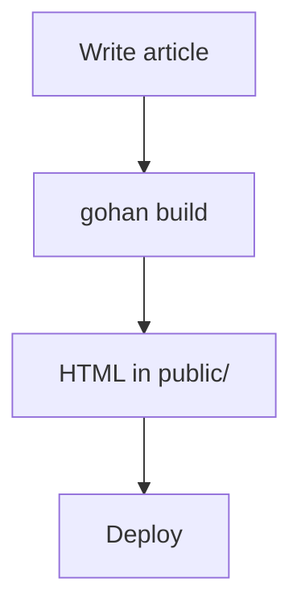

# Template Guide

gohan themes are built with Go's standard `html/template` package.

> 日本語版: [templates.ja.md](templates.ja.md)

---

## Template files

All `.html` files inside the theme directory (`themes/default/templates/` by default) are loaded automatically.

### Required templates

| File | URL pattern | Description |
|---|---|---|
| `index.html` | `/` | Site top page (full article list) |
| `article.html` | `/posts/<slug>/` | Individual article page |
| `tag.html` | `/tags/<name>/` | Tag article list page |
| `category.html` | `/categories/<name>/` | Category article list page |
| `archive.html` | `/archive/<year>/` | Year-based archive page |

> If a template file does not exist, that page is simply not generated (no error is raised).

---

## Template data

Every template receives a value of type `model.Site`.

### Site

```go
type Site struct {
    Config     Config              // Settings from config.yaml
    Articles   []*ProcessedArticle // Articles for the current page (filtered)
    Tags       []Taxonomy          // All tags across the site
    Categories []Taxonomy          // All categories across the site
}
```

### Config

```go
type Config struct {
    Site  SiteConfig
    Theme ThemeConfig
    Build BuildConfig
}

type SiteConfig struct {
    Title       string // .Config.Site.Title
    Description string // .Config.Site.Description
    BaseURL     string // .Config.Site.BaseURL
    Language    string // .Config.Site.Language
}

type ThemeConfig struct {
    Name   string
    Dir    string
    Params map[string]string // .Config.Theme.Params
}
```

### ProcessedArticle

```go
type ProcessedArticle struct {
    FrontMatter  FrontMatter    // Parsed YAML Front Matter
    HTMLContent  template.HTML  // Rendered HTML
    Summary      string         // First ~200 characters
    OutputPath   string         // Output file path
    FilePath     string         // Source Markdown file path
    LastModified time.Time      // Last modified time
}

type FrontMatter struct {
    Title       string
    Date        time.Time
    Draft       bool
    Tags        []string
    Categories  []string
    Description string
    Author      string
    Slug        string
    Template    string
}
```

### Taxonomy

```go
type Taxonomy struct {
    Name        string // Tag or category name
    Description string // Optional description
}
```

---

## `.Articles` contents per template

| Template | `.Articles` contains |
|---|---|
| `index.html` | All articles on the site |
| `article.html` | The single article being rendered |
| `tag.html` | Articles that have this tag |
| `category.html` | Articles that belong to this category |
| `archive.html` | Articles published in this year |

---

## Built-in functions

| Function | Example | Description |
|---|---|---|
| `formatDate` | `{{formatDate "2006-01-02" .FrontMatter.Date}}` | Format a `time.Time` value |
| `tagURL` | `{{tagURL "go"}}` → `/tags/go/` | Generate a tag page URL |
| `categoryURL` | `{{categoryURL "tech"}}` → `/categories/tech/` | Generate a category page URL |
| `markdownify` | `{{markdownify "**bold**"}}` | Convert a Markdown string to HTML |

`formatDate` uses Go's [reference time](https://pkg.go.dev/time#Layout) layout:

- `"2006-01-02"` → `2024-01-15`
- `"January 2, 2006"` → `January 15, 2024`

---

## Template examples

### `index.html` — Top page

```html
<!DOCTYPE html>
<html lang="{{.Config.Site.Language}}">
<head>
  <meta charset="UTF-8">
  <meta name="description" content="{{.Config.Site.Description}}">
  <title>{{.Config.Site.Title}}</title>
  <link rel="stylesheet" href="/assets/style.css">
  <link rel="alternate" type="application/atom+xml" title="{{.Config.Site.Title}}" href="/atom.xml">
</head>
<body>
  <header>
    <h1><a href="/">{{.Config.Site.Title}}</a></h1>
    <p>{{.Config.Site.Description}}</p>
  </header>
  <main>
    <ul>
      {{range .Articles}}
      <li>
        <time>{{formatDate "2006-01-02" .FrontMatter.Date}}</time>
        <a href="/posts/{{.FrontMatter.Slug}}/">{{.FrontMatter.Title}}</a>
        {{if .FrontMatter.Tags}}
        <span>
          {{range .FrontMatter.Tags}}<a href="{{tagURL .}}">#{{.}}</a> {{end}}
        </span>
        {{end}}
      </li>
      {{end}}
    </ul>
  </main>
  <footer>
    <a href="/sitemap.xml">Sitemap</a> · <a href="/atom.xml">Feed</a>
    {{if .Config.Theme.Params.footer_text}}
    <p>{{.Config.Theme.Params.footer_text}}</p>
    {{end}}
  </footer>
</body>
</html>
```

### `article.html` — Article page

```html
<!DOCTYPE html>
<html lang="{{.Config.Site.Language}}">
<head>
  <meta charset="UTF-8">
  {{with (index .Articles 0)}}
  <meta name="description" content="{{.FrontMatter.Description}}">
  <title>{{.FrontMatter.Title}} — {{$.Config.Site.Title}}</title>
  {{end}}
  <link rel="stylesheet" href="/assets/style.css">
</head>
<body>
  <header><nav><a href="/">← {{.Config.Site.Title}}</a></nav></header>
  <main>
    {{with (index .Articles 0)}}
    <article>
      <h1>{{.FrontMatter.Title}}</h1>
      <time>{{formatDate "January 2, 2006" .FrontMatter.Date}}</time>
      {{if .FrontMatter.Author}}<span> · {{.FrontMatter.Author}}</span>{{end}}
      {{if .FrontMatter.Tags}}
      <ul class="tags">
        {{range .FrontMatter.Tags}}<li><a href="{{tagURL .}}">{{.}}</a></li>{{end}}
      </ul>
      {{end}}
      <div class="content">{{.HTMLContent}}</div>
    </article>
    {{end}}
  </main>
</body>
</html>
```

### `tag.html` — Tag page

```html
<!DOCTYPE html>
<html lang="{{.Config.Site.Language}}">
<head>
  <meta charset="UTF-8">
  <title>Tag: {{(index .Articles 0).FrontMatter.Tags}} — {{.Config.Site.Title}}</title>
  <link rel="stylesheet" href="/assets/style.css">
</head>
<body>
  <header><nav><a href="/">← {{.Config.Site.Title}}</a></nav></header>
  <main>
    <h2>Articles ({{len .Articles}})</h2>
    <ul>
      {{range .Articles}}
      <li>
        <time>{{formatDate "2006-01-02" .FrontMatter.Date}}</time>
        <a href="/posts/{{.FrontMatter.Slug}}/">{{.FrontMatter.Title}}</a>
      </li>
      {{end}}
    </ul>
  </main>
</body>
</html>
```

---

## Advanced features

### Mermaid diagrams

Write a fenced code block with the `mermaid` language identifier:

````text

````

gohan automatically injects the Mermaid runtime script when it detects a mermaid block.

### Syntax highlighting

Fenced code blocks are highlighted automatically using [chroma](https://github.com/alecthomas/chroma). Styles are applied via inline CSS — no external stylesheet is required.

### Template partials

Create reusable partial templates using `{{define}}` and `{{template}}`:

```
themes/default/templates/
├── index.html
├── article.html
└── _partials/
    ├── header.html   ← defines "header"
    └── footer.html   ← defines "footer"
```

```html
<!-- _partials/header.html -->
{{define "header"}}
<header>
  <h1><a href="/">{{.Config.Site.Title}}</a></h1>
</header>
{{end}}
```

```html
<!-- index.html -->
<!DOCTYPE html>
<html>
<body>
  {{template "header" .}}
  <main>...</main>
</body>
</html>
```
