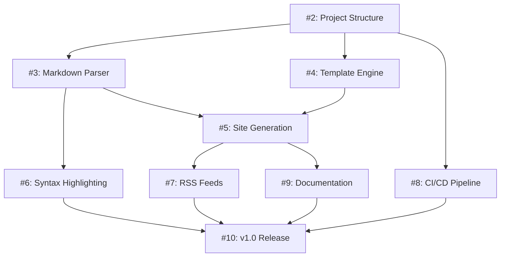

# Project Management: Gohan v1.0 Development

## 📋 Overview

This document describes the project management approach for Gohan v1.0 development using GitHub Projects.

**Project URL**: https://github.com/users/bmf-san/projects/3

## 🎯 Project Structure

### Development Phases

1. **🏗️ Foundation** (Phase 1)
   - Project structure setup
   - Basic CLI framework
   - Configuration management

2. **⚡ Core Features** (Phase 2)
   - Markdown parser
   - Template engine
   - Site generation pipeline

3. **✨ Additional Features** (Phase 3)
   - Syntax highlighting
   - RSS/Atom feeds
   - Enhanced functionality

4. **🔧 Quality & Automation** (Phase 4)
   - CI/CD pipeline
   - Documentation
   - Testing framework

5. **🚀 Release Preparation** (Phase 5)
   - Final testing
   - Release automation
   - v1.0 launch

## 📊 Issue Organization

### Current Issues in Project

| Issue # | Title | Phase | Priority | Estimate |
|---------|-------|-------|----------|----------|
| #2 | Setup Go project structure and basic CLI | Foundation | High | 3-5 days |
| #3 | Implement Markdown parser with Front Matter | Core | High | 4-6 days |
| #4 | Implement template engine with custom functions | Core | High | 5-7 days |
| #5 | Implement core site generation and build pipeline | Core | High | 6-8 days |
| #6 | Add syntax highlighting for code blocks | Features | Medium | 3-4 days |
| #7 | Implement RSS and Atom feed generation | Features | Medium | 3-4 days |
| #8 | Set up CI/CD pipeline and automated releases | Quality | High | 4-5 days |
| #9 | Create comprehensive user and developer documentation | Quality | Medium | 5-6 days |
| #10 | v1.0 Release preparation and final testing | Release | High | 6-8 days |

### Dependencies



## 🔄 Workflow States

### Board Columns

1. **📝 Backlog**
   - Issues not yet started
   - Waiting for dependencies

2. **🚀 Ready**
   - Dependencies resolved
   - Ready to start implementation

3. **🔄 In Progress**
   - Currently being worked on
   - Should have assignee

4. **👀 In Review**
   - Pull request submitted
   - Awaiting code review

5. **✅ Done**
   - Implementation complete
   - Tests passing
   - Merged to main branch

## 📈 Progress Tracking

### Sprint Planning (2-week sprints)

**Sprint 1** (Week 1-2)
- Issues: #2, #3
- Goal: Basic foundation and markdown parsing

**Sprint 2** (Week 3-4)
- Issues: #4, #5
- Goal: Template engine and site generation

**Sprint 3** (Week 5-6)
- Issues: #6, #7, #8
- Goal: Additional features and CI/CD

**Sprint 4** (Week 7-8)
- Issues: #9, #10
- Goal: Documentation and release preparation

### Key Metrics

- **Velocity**: Issues completed per sprint
- **Burn-down**: Remaining story points over time
- **Cycle Time**: Time from "In Progress" to "Done"
- **Lead Time**: Time from "Backlog" to "Done"

## 🎲 Risk Management

### High-Risk Items

1. **Performance Requirements**
   - Risk: Build times exceed 5-minute target
   - Mitigation: Early performance testing, parallel processing

2. **Template Engine Complexity**
   - Risk: Custom functions become too complex
   - Mitigation: Start with simple functions, iterate

3. **CI/CD Setup**
   - Risk: Cross-platform testing issues
   - Mitigation: Start with single platform, expand gradually

### Contingency Plans

- **Scope Reduction**: Remove non-critical features if timeline at risk
- **Quality Gates**: Don't compromise on test coverage or documentation
- **External Dependencies**: Have backup libraries identified

## 📋 Meeting Schedule

### Weekly Standup (If team expands)
- **When**: Every Monday 10:00 AM JST
- **Duration**: 15 minutes
- **Format**: What did you do? What will you do? Any blockers?

### Sprint Planning
- **When**: Every 2 weeks
- **Duration**: 1 hour
- **Goal**: Plan next sprint, review previous sprint

### Retrospective
- **When**: End of each sprint
- **Duration**: 30 minutes
- **Goal**: Identify improvements and celebrate successes

## 🛠️ Tools and Links

- **Project Board**: https://github.com/users/bmf-san/projects/3
- **Repository**: https://github.com/bmf-san/gohan
- **Design Document**: [docs/design.md](design.md)
- **Contributing Guide**: [CONTRIBUTING.md](../CONTRIBUTING.md)

## 📝 Status Updates

### Weekly Status Template

```markdown
## Week of [Date]

### Completed
- [ ] Issue #X: Description
- [ ] Issue #Y: Description

### In Progress
- [ ] Issue #Z: Description (X% complete)

### Planned for Next Week
- [ ] Issue #A: Description
- [ ] Issue #B: Description

### Blockers/Issues
- None / [Description of blocker]

### Metrics
- Issues completed: X
- Issues in progress: Y
- Next milestone: [Milestone name] ([Date])
```

## 🎯 Success Criteria for v1.0

### Technical Goals
- [ ] All 9 issues completed
- [ ] 80%+ test coverage
- [ ] Build time under 5 minutes for 1000 articles
- [ ] Cross-platform compatibility (Windows, macOS, Linux)
- [ ] Documentation complete

### Quality Gates
- [ ] All CI/CD checks pass
- [ ] Security scan clean
- [ ] Performance benchmarks met
- [ ] User acceptance testing complete

### Release Readiness
- [ ] Binary distribution working
- [ ] Release notes complete
- [ ] Migration guide available
- [ ] Community feedback incorporated

---

*Last updated: August 17, 2025*
